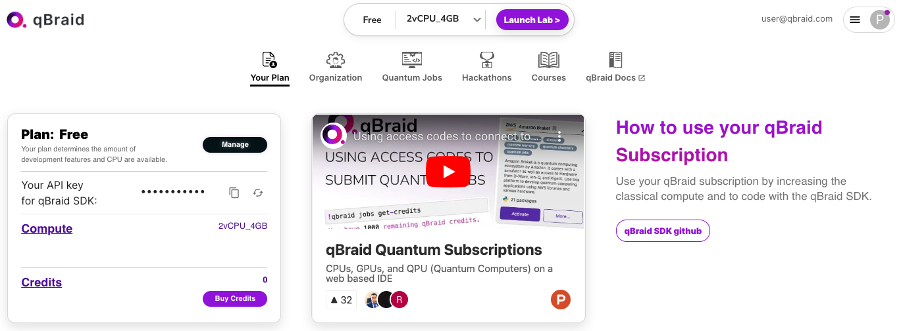
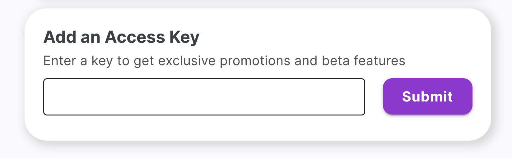

.. _lab_account:

Account
========

To use qBraid Lab, you must first sign in or create an account at `account.qbraid.com <https://account.qbraid.com>`_.

Add access key
---------------

Use the following steps to redeem qBraid credits and/or gain access to premium features
of qBraid Lab using an access key or promotional code:

1. Sign in to `account.qbraid.com <https://account.qbraid.com>`_.

2. On the left side of the page, inside the **Plan** info card, click **Manage**.

|accountManage|

3. Scroll down to **Access Key**, enter your key or promo-code, and click **Submit**.

|submit|

*Congrats!* Your new credits and/or permissions have now been added to your account.

.. seealso::
    
    - `Using access codes to connect to quantum devices on qBraid | Demo <https://youtu.be/K4vb2fzmSZQ>`_

Organizations
---------------

.. seealso::

    - `<https://account.qbraid.com/organization>`_