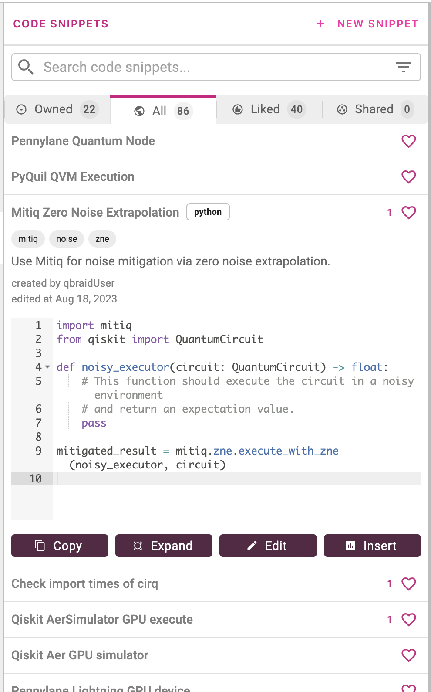

.. _lab_code_snippets:

Code Snippets
===============

Code snippets are concise, reusable blocks of code that serve as ready-to-use solutions for common programming tasks.
They provide developers with a convenient way to access frequently used code patterns, thus streamlining the coding process
and enhancing productivity.

qBraid Lab Code Snippets stands out as a distinctively quantum-centric solution. Designed expressly for researchers and developers
in quantum computing, this extension offers an easy, anonymous, and enriching means of **collaboration** across the **quantum software ecosystem**.

Key Features
------------

- **Quantum-Centric Design**

    qBraid code snippets are quantum-focused, and community moderated.

- **Levels of Visibility**

    Choose between private, shared, or public visibility for your code snippets.

- **Advanced Categorization**
    
    Snippets come with a title, description, and tags, streamlining the search and discovery process.

- **Community Collaboration & Recognition**
    
    Engage with snippets through "likes", and gain recognition through the "contributor" status.

- **Admin-Endorsed Snippets**
    
    Look for the ``admin`` tag for reliable and high-quality snippets from qBraid Administrators.

- **Syntax Highlighting Variability**
    
    Supports various coding languages including Markdown, Python and Julia, with Q# soon to be added.

- **Swift Integration**
    
    Copy snippets or inject them directly into active notebooks. Open large snippets with expanded view.

- **Editing & Control**
    
    Modify your snippets' content and adjust their visibility as needed.

