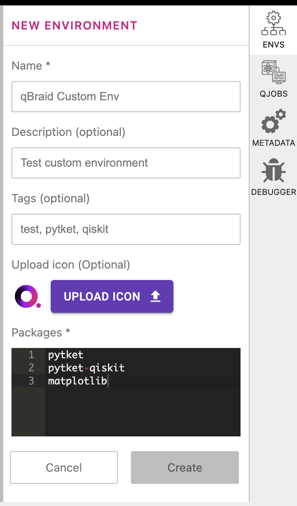
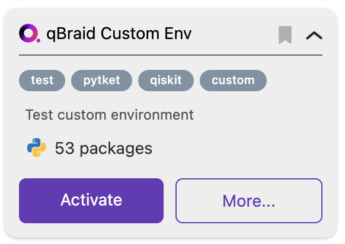
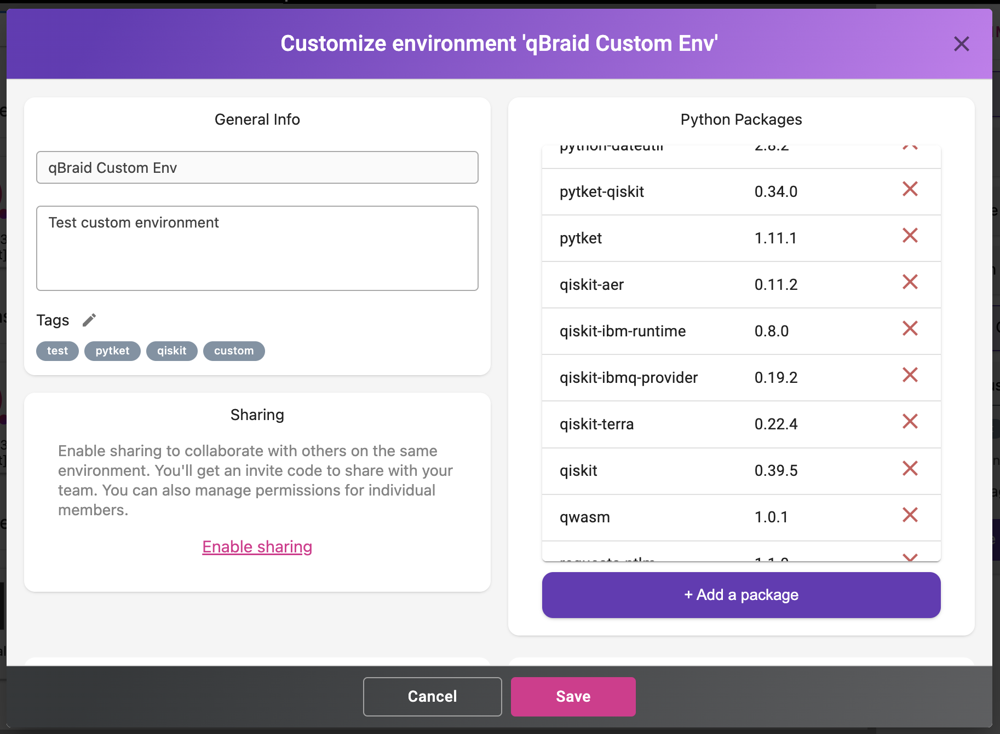

.. _lab_env_create:

Create environment
===================

1. In the Environment Manager sidebar, click **Add**, and then click **New Environment**.

2. Give your custom environment a name, description, and optionally specify a path to
a ``requirements.txt`` file in your lab filesystem.

|

After clicking **Create**, a new environment panel is created for your custom environment.

3. Once the environment has been created and any ``requirements.txt`` installations have finished,
the environment panel's action button will switch from **Installing...** to **Activate**, and
the installed packages number will be updated.

|

Click on **More** to verify/view the list of installed packages.

|