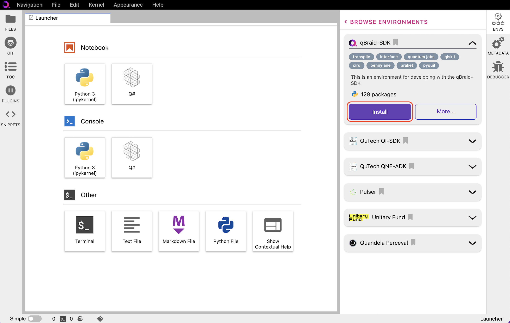
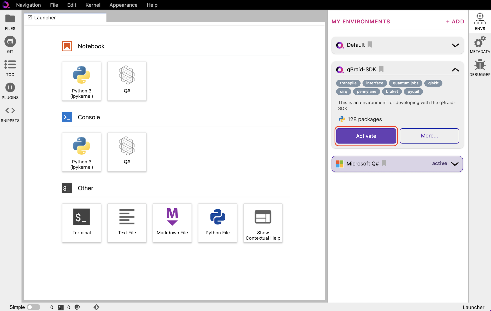

.. _lab_env_install:

Install environment
====================

1. In the Environment Manager sidebar, click **Add** to view the environments available to install.

2. Choose an environment, expand its pannel, and click **Install**.

  
|

3. Once the installation has started, the pannel is moved to the **My Environments** tab.
Click **Browse Environments** to return to the **My Environments** tab and view its progress.

.. image:: ../_static/lab-files/env_installing.png
    :align: center
    :width: 800px
    :target: javascript:void(0);
  
|

4. When the installation is complete, the environment panel's action button will switch from
**Installing...** to **Activate**. Clicking **Activate** creates a new ipykernel, see
`Manage kernels <kernel-manage.html>`_ for more.

  
|

To uninstall the environment, click on **More**, and then **Uninstall**.