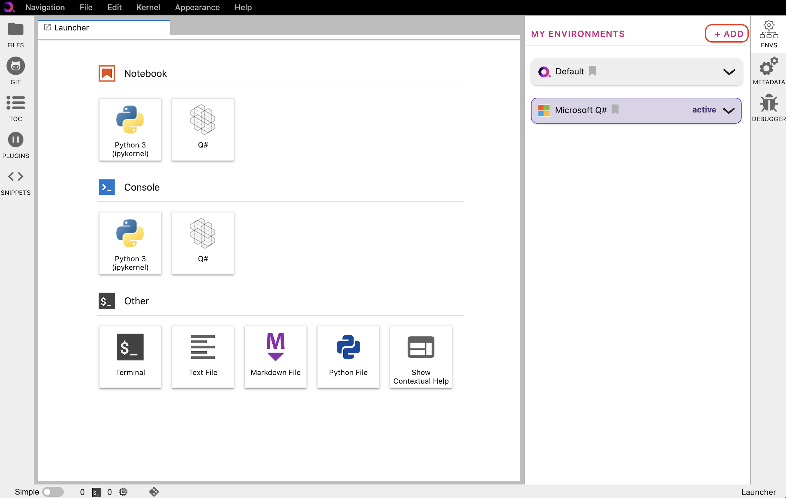

.. _lab_env_install:

Install environment
====================

In the Environment Manager sidebar, click **Add** to view the environments available to install.

|

Choose an environment, expand its pannel, and click **Install**.

.. image:: ../_static/lab-files/env_install.png
    :align: center
    :width: 800px
    :target: javascript:void(0);
  
|

Once the installation has started, the pannel is moved to the **My Environments** tab.
Click **Browse Environments** to return to the **My Environments** tab and view its progress.

.. image:: ../_static/lab-files/env_installing.png
    :align: center
    :width: 800px
    :target: javascript:void(0);
  
|

When the installation is complete, the environment panel's action button will switch from
**Installing...** to **Activate**.

.. image:: ../_static/lab-files/kernel_activate.png
    :align: center
    :width: 800px
    :target: javascript:void(0);
  
|

To uninstall an environment, click on **More**, and then **Uninstall**.