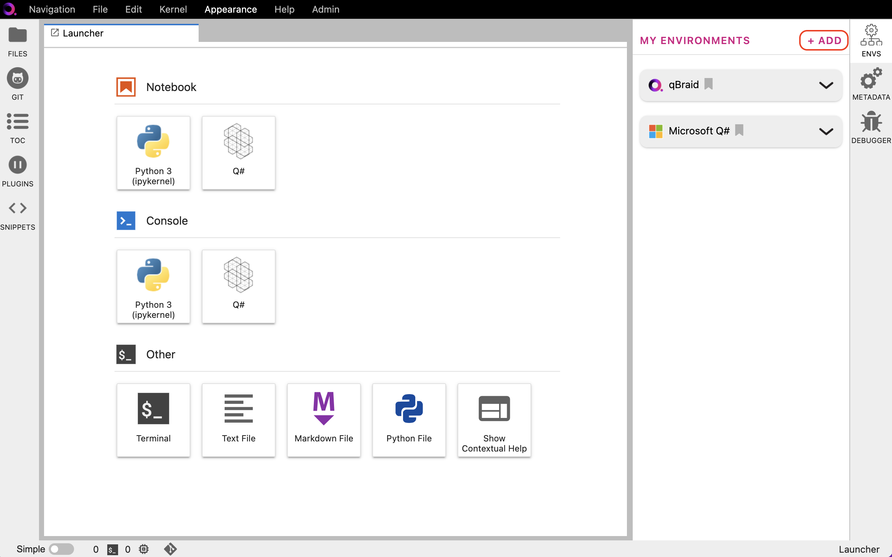
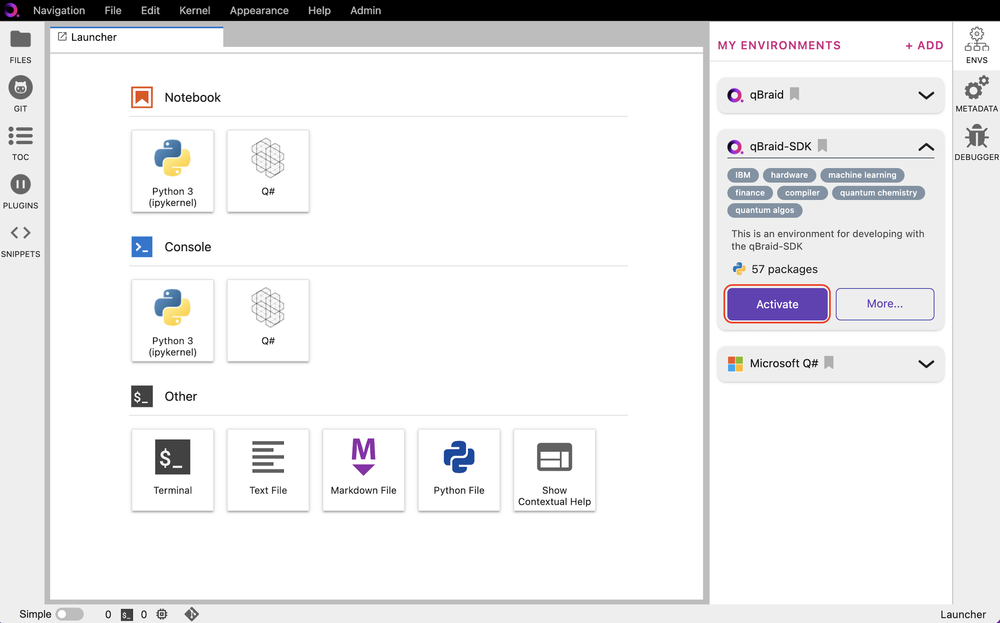

.. _lab_envs:

Environment Manager
====================

The qBraid Lab Environment Manager is a robust package and virtual environment management system
provided to qBrad end-users through a simple, intuitive graphical user interface.

To expand the Environment Manager sidebar, click on **Envs** in the upper-right of the Lab console.
**My Environments** are your currently installed environments. The qBraid base environment and
Microsoft Q# environment are installed by default.

Installing an environment
--------------------------

1. In the Environment Manager sidebar, click **Add** to view the environments available to install.

|

2. Choose an environment, expand its pannel, and click **Install**.

.. image:: ../_static/setup/1_install.png
    :align: center
    :width: 800px
    :target: javascript:void(0);
  
|

3. Once the installation has started, the pannel is moved to the **My Environments** tab.
Click **Browse Environments** to return to the **My Environments** tab and view its progress.
When the installation is complete, the environment pannel's action button will switch from
**Installing...** to **Activate**.

.. _lab_envs_activate:

Activating an environment
--------------------------

1. Under **My Environments**, choose the environment, and expand its pannel.

2. Click **Activate** to activate the environment and create an associated ipykernel.

|