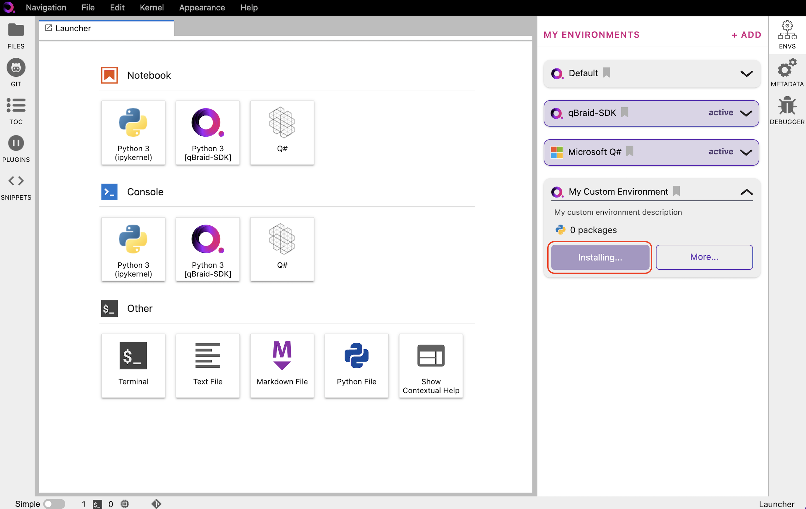

.. _lab_environments:

Environments
=============

The qBraid Lab Environment Manager is a robust package and virtual environment management system
provided to qBraid end-users through a simple, intuitive graphical user interface.

To expand the Environment Manager sidebar, click on **Envs** in the upper-right of the Lab console.
**My Environments** are your currently installed environments. The qBraid Default environment and
Microsoft Q# environment are installed by default.

Install environment
--------------------

1. In the Environment Manager sidebar, click **Add** to view the environments available to install.

2. Choose an environment, expand its pannel, and click **Install**.

.. image:: ../_static/lab-files/env_install.png
    :align: center
    :width: 800px
    :target: javascript:void(0);
  
|

3. Once the installation has started, the pannel is moved to the **My Environments** tab.
Click **Browse Environments** to return to the **My Environments** tab and view its progress.

.. image:: ../_static/lab-files/env_installing.png
    :align: center
    :width: 800px
    :target: javascript:void(0);
  
|

4. When the installation is complete, the environment panel's action button will switch from
**Installing...** to **Activate**. Clicking **Activate** creates a new ipykernel, see
`Kernels <kernels.html>`_ for more.

.. image:: ../_static/lab-files/kernel_activate.png
    :align: center
    :width: 800px
    :target: javascript:void(0);
  
|

To uninstall the environment, click on **More**, and then **Uninstall**.

Create environment
-------------------

.. image:: ../_static/lab-files/env_create.png
    :align: right
    :width: 300px
    :target: javascript:void(0);

\1. In the Environment Manager sidebar, click **Add**, then click **New Environment**.

\2. Give your custom environment a name, description, add tags, upload a logo,
and specify any packages to install using a ``requirements.txt`` format.

After clicking **Create**, a new environment panel is created for your custom environment.
You can view the environment's install progress by returning to **My Environments**.

|progress|

.. image:: ../_static/lab-files/custom_pkgs.png
    :align: right 
    :width: 300px
    :target: javascript:void(0);

\3. Once the environment has been created and any package installations have finished,
the environment panel's action button will switch from **Installing...** to **Activate**, and
the installed packages number will be updated.

\4. Click on **More** to verify/view the environment's list of installed packages. You can use
the search bar or scroll through the Python package (pip) list to find the exact versions of all
packages and package dependecies that were installed. From the **More** pop-out, you can also
install additional packages, remove packages, add/delete tags, and edit the environment's description.

.. image:: ../_static/lab-files/env_more.png
    :align: center
    :width: 800px
    :target: javascript:void(0);

|

.. seealso::
    
    - `Install & manage quantum software in the cloud on qBraid | Demo <https://youtu.be/LyavbzSkvRo>`_