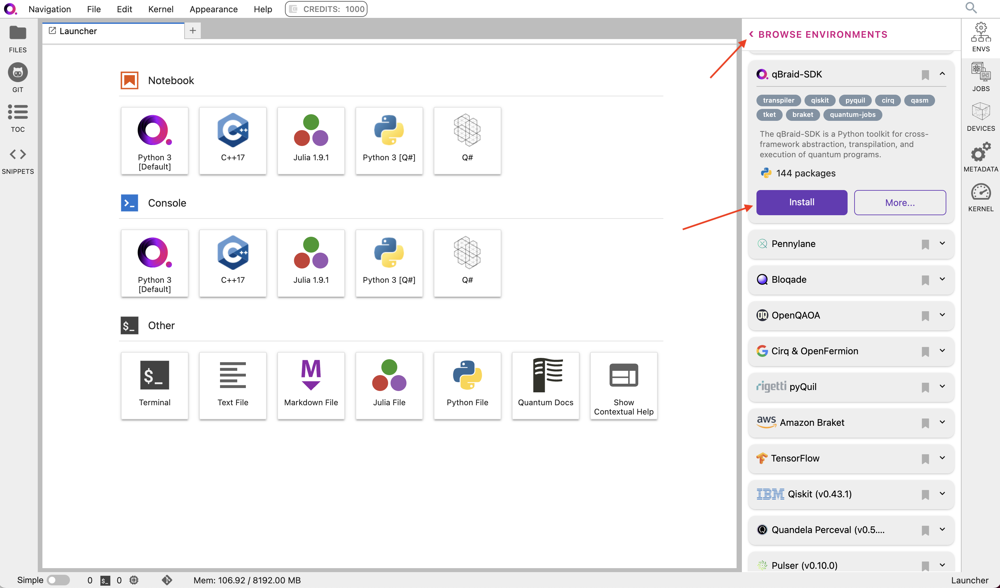
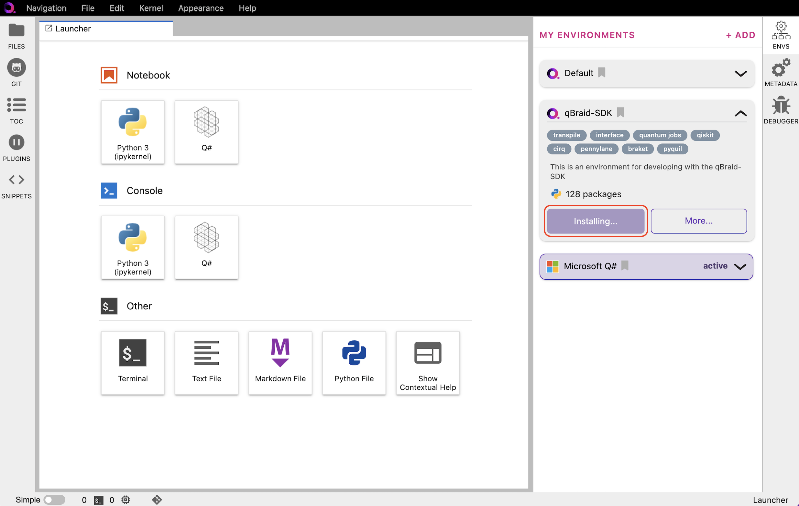
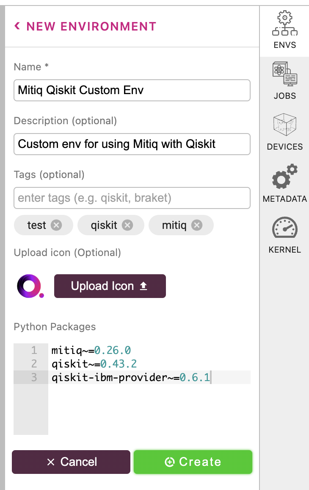
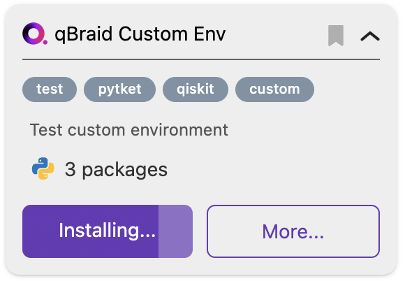
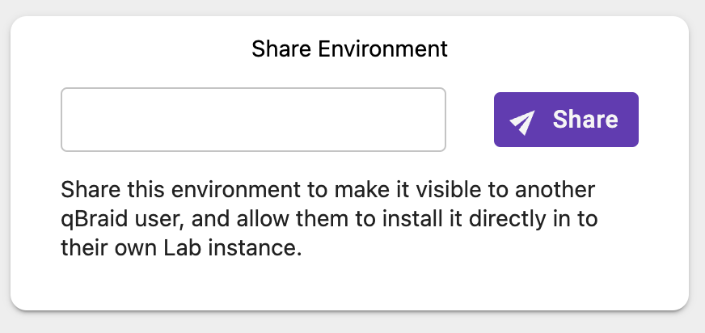
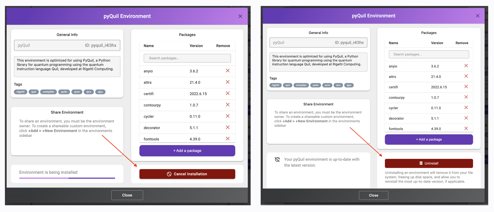
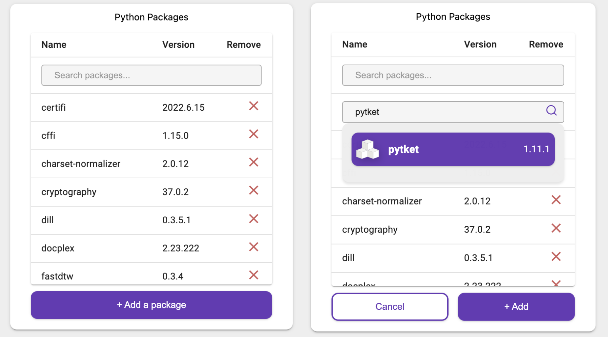
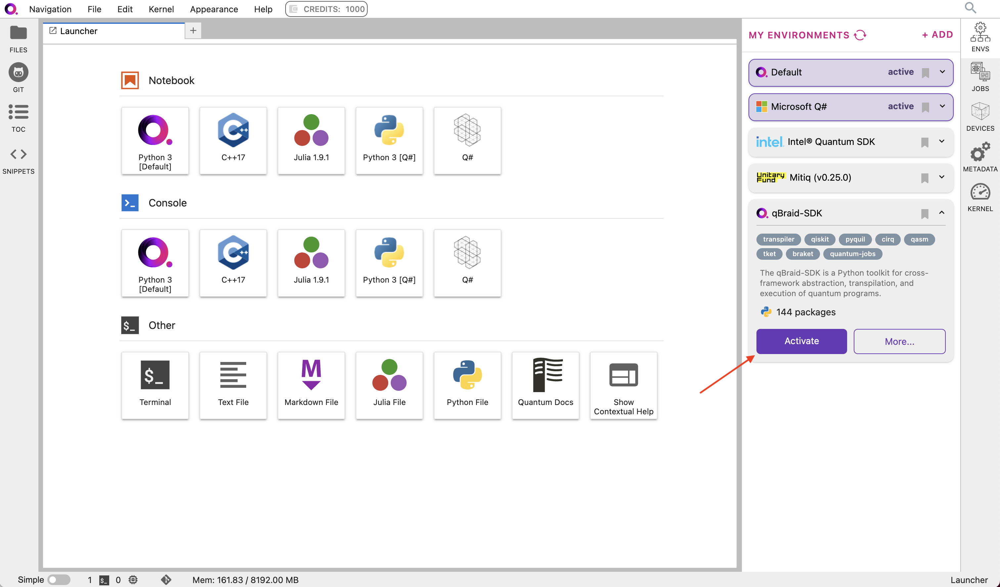

.. _lab_environments:

Environments
=============

The `qBraid Lab Environment Manager <https://youtu.be/LyavbzSkvRo>`_ is a streamlined quantum software package and
virtual environment management system provided to qBraid end-users through a simple, intuitive graphical user interface.
It offers curated development environments in Python, Julia, C++, and Q# over a range of quantum applications, is highly
customizable, and facilitates direct connections to quantum hardware.

To expand the Environment Manager sidebar, click on **Envs** in the upper-right of the Lab console.
**My Environments** are your currently installed environments. The qBraid Default Python environment
is pre-installed for all users. For `Standard/Pro users <https://account.qbraid.com/subscription>`_,
a number of other environments are also available pre-installed. These include Microsoft QDK (Q#),
the Intel® Quantum SDK (C++), Bloqade (Julia), cuQuantum (CUDA), and more.

Key Features
------------

- **Pre-Packaged Environments**: 

    qBraid Lab provides a suite of 30+ pre-packaged virtual environments dedicated to popular quantum software packages.
    These include but are not limited to Qiskit, Cirq, Amazon Braket, Pennylane, PyQuil, TensorFlow Quantum, and more.
    Each environment incorporates not only the primary packages but also recommended add-ons and configurations. Environments
    are pre-configured to function out-of-the-box, eliminating the hassle of manual installations and potential dependency conflicts.

- **Comprehensive Environment Search**:

    Locate and install the ideal environment for your project by searching by name, description, tag, or package. This
    intuitive search feature ensures you find an environment tailored to your use case.

- **Version Management**:

    Stay updated without the hassle. Minor software updates are reflected in the pre-packaged environments, which users
    can reinstall to access. For significant or breaking updates, entirely new environments are made available, preserving
    the integrity of projects relying on earlier versions.

- **Customize and Share**:

    Customize pre-packaged environments by installing or upgrading packages, or create your own custom environments that
    can be shared directly with other qBraid Lab users.

- **Detailed Dependency Overview**:

    Each environment showcases a complete list of its packages, akin to a `pip freeze`. Users can browse and search through
    these packages pre- and post-installation, making it easy to keep track of the tools at their disposal. This package list
    is dynamically updated to mirror any user-driven changes.

- **Direct Hardware Connectivity**:

    Environments marked with the ``quantum-jobs`` tag can be used to connect directly to a range of QPU devices from leading
    providers, including IonQ, Oxford Quantum Circuits, QuEra, Rigetti, and AWS on-demand simulators, with no additional
    access keys required.

- **Command-Line Interface**:

    For those who prefer terminal-based interactions, qBraid Lab provides a command-line interface that mirrors the
    functionalities of the GUI-based Environment Manager. Users can activate environments, manage kernels, install new
    packages, enable quantum jobs, and much more directly from their terminal.

 .. seealso::
   
    - `Install & manage quantum software in the cloud on qBraid | Demo <https://youtu.be/LyavbzSkvRo>`_
    - `New Environment Request Form <https://forms.gle/a4v7Kdn7G7bs9jYD8>`_
    - `qBraid GPU pre-launch waitlist <https://tinyurl.com/4metnzpb>`_

Install environment
--------------------

\1. In the Environment Manager sidebar, click **Add** to view the environments available to install.

\2. Choose an environment, expand its pannel, and click **Install**.

  
|

\3. Once the installation has started, the pannel is moved to the **My Environments** tab.
Click **Browse Environments** to return to the **My Environments** tab and view its progress.

  
|

\4. When the installation is complete, the environment panel's action button will switch from
**Installing...** to **Activate**.

Create environment
-------------------

\1. In the Environment Manager sidebar, click **Add**, then click **New Environment**.

\2. Give your custom environment a name, description, add tags, upload a logo,
and specify any packages to install using a ``requirements.txt`` format.

After clicking **Create**, a new environment panel is created for your custom environment.
You can view the environment's install progress by returning to **My Environments**.

|progress|

\3. Once the environment has been created and any package installations have finished,
the environment panel's action button will switch from **Installing...** to **Activate**, and
the installed packages number will be updated.

\4. Click on **More** to verify/view the environment's list of installed packages. You can use
the search bar or scroll through the Python package (pip) list to find the exact versions of all
packages and package dependecies that were installed. From the **More** pop-out, you can also
install additional packages, remove packages, add/delete tags, and edit the environment's description.

Share environment
-------------------

In qBraid Lab, you can share your custom environments with other users. This will make your
environment visible under their **Add** environment list. They can then install it, and
run code using an exact copy of your environment. This includes support for quantum
jobs and any additional configurations.

Although modifications to pre-packaged environments can't be directly shared, you can export a ``requirements.txt`` from
any environment to use in creating a new custom environment "copy", which can then be shared with other users.

To share a custom environment, first click the **More** button in the drop-down to open the environment editor.
Then, under 'Share Environment' , enter the qBraid user email, and click **Share**.

When you share an environment on qBraid, you're creating a snapshot of your Python virtual environment with its specific configurations
and installed packages. This snapshot is uploaded to the qBraid cloud, creating a static version accessible to other users. This shared
version remains unchanged, even if you make updates to your local environment. To reflect any changes, you'd need to re-share and overwrite
the existing version in the cloud.

Overwriting a globally shared environment doesn't affect versions that other users have already downloaded. Instead, an indicator notifies
them of the availability of an updated version. Currently, users must manually check for this indicator. Also, before installing an updated
version, users must uninstall their current one as maintaining multiple versions of a shared environment isn't supported. Sharing or overwriting
globally doesn't impact your local environment.

Uninstall / cancel install environment
---------------------------------------

To uninstall an environment or cancel the installation of an environment, click on **More**, and then **Uninstall** or **Cancel Installation**.

  
|

Install new package
--------------------

There are three ways to install a new package into an environment on qBraid:

1. Add a package button
^^^^^^^^^^^^^^^^^^^^^^^^^

Open the Environment Manager (``ENVS``) sidebar, and find the environment into which you want to install the package.
Expand the environment panel using the carrot drop-down, and then click **More**.

At the bottom of the Python packages list, click **Add a package**. Type in the *exact* name of the package you wish to install
into the "Add package..." search bar, and then hit ``Enter`` (or click the search icon on the right). This will do a direct search
through `PyPI <https://pypi.org/>`_, and return the *latest* version available to install. To accept, click on the packge, and then
click **Add**.

While installing, the environment action button will indicate **Installing...**. Once complete, Lab will notify with a pop-up.

2. IPython magic command
^^^^^^^^^^^^^^^^^^^^^^^^^

From inside a notebook, run your pip command using the "magic" ``%`` operator to install
the desired package(s) within the current kernel:

.. code-block:: python

    %pip install [pkgs]

.. seealso::
    
    - `IPython Built-in magic commands (pip) <https://ipython.readthedocs.io/en/stable/interactive/magics.html#magic-pip>`_.

3. Directly from terminal
^^^^^^^^^^^^^^^^^^^^^^^^^^^

From Launcher, under "Other", click on Terminal. By default, your qBraid terminal opens using
Python (and pip) from ``/opt/conda/bin``. Packages that are installed directly at this top-level
will *not* persist between sessions. Instead, use the qBraid CLI to list your environments,

.. code-block:: console

   $ qbraid envs list
   # installed environments:
   #
   qsharp                         /opt/.qbraid/environments/qsharp_b54crn
   default                  jobs  /opt/.qbraid/environments/qbraid_000000
   qbraid_sdk               jobs  /home/jovyan/.qbraid/environments/qbraid_sdk_9j9sjy
   qiskit                         /home/jovyan/.qbraid/environments/qiskit_9y9siy

activate an environment, and perform your pip installs from there. For example, installing pytket into the qiskit environment:

.. code-block::

   $ qbraid envs activate qiskit
   $ python -m pip install pytket
   $ deactivate

Activate environment (kernel)
------------------------------

Clicking **Activate** creates a new ipykernel, see `Add/remove kernels <kernels.html#add-remove-kernels>`_ for more.

  
|

Command-line usage 
--------------------

qBraid environments are simply `Python virtual environments <https://docs.python.org/3/library/venv.html>`_ in disguise.
There are two directories where qBraid environment can be found. One at the system level, and one at the local / user level:

.. code-block:: console

   $ echo $QBRAID_USR_ENVS
   /home/jovyan/.qbraid/environments
   $ echo $QBRAID_SYS_ENVS
   /opt/.qbraid/environments

The environments at the the system level are reset each time you launch Lab, so any changes made to these environments will not persist between sessions.
The user level environments are yours to modify: any and all changes you make to these environments will still be there the next time to launch Lab.
The qBraid CLI provides convenient short-cuts to activate and install pacakages into your qBraid environments, however all of the traditional commands
to activate and manipulate Python venvs still apply. For example, you can activate an environment using the
`source command <https://docs.python.org/3/library/venv.html#how-venvs-work>`_:

.. code-block:: console

   $ source $QBRAID_USR_ENVS/<slug>/pyenv/bin/activate

If you're working in terminal, you don't specifically need to activate a qBraid environment, as you can just specify the full path to that environment's
Python interpreter when invoking Python, e.g. ``/<path-to-venv>/bin/python``. The same is true for ``pip`` commands. So if you are attempting to install
new packages into a qBraid environment from terminal or inside a notebook, make sure to use the full pip path, or use one of the `three approaches
detailed above <environments.html#install-new-package>`_. Simply running ``pip install ...`` will default to
``/opt/conda/bin/pip``, which will cause dependency conflicts, and the installed packages will be overridden the next time you launch lab.
