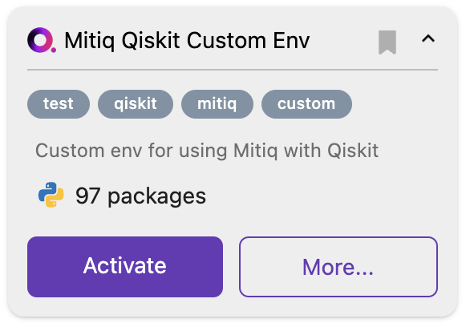
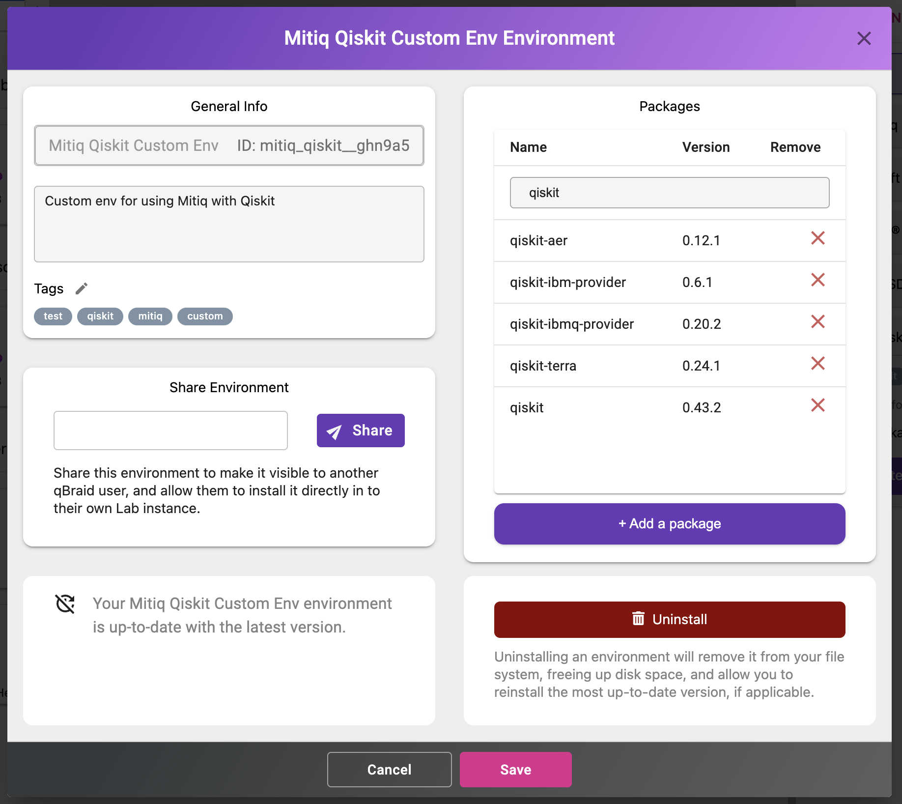
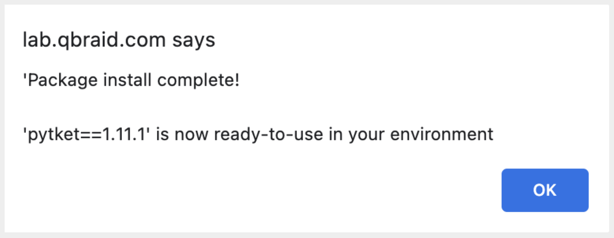

.. _lab_environments:

Environments
=============

The qBraid Lab Environment Manager is a robust package and virtual environment management system
provided to qBraid end-users through a simple, intuitive graphical user interface.

To expand the Environment Manager sidebar, click on **Envs** in the upper-right of the Lab console.
**My Environments** are your currently installed environments. The qBraid Default environment and
Microsoft Q# environment are installed by default.

 .. seealso::
   
    - `Install & manage quantum software in the cloud on qBraid | Demo <https://youtu.be/LyavbzSkvRo>`_

Install environment
--------------------

1. In the Environment Manager sidebar, click **Add** to view the environments available to install.

2. Choose an environment, expand its pannel, and click **Install**.

.. image:: ../_static/environments/env_install.png
    :align: center
    :width: 800px
    :target: javascript:void(0);
  
|

3. Once the installation has started, the pannel is moved to the **My Environments** tab.
Click **Browse Environments** to return to the **My Environments** tab and view its progress.

.. image:: ../_static/environments/env_installing.png
    :align: center
    :width: 800px
    :target: javascript:void(0);
  
|

4. When the installation is complete, the environment panel's action button will switch from
**Installing...** to **Activate**. Clicking **Activate** creates a new ipykernel, see
`Add/remove kernels <notebooks.html#add-remove-kernels>`_ for more.

.. image:: ../_static/notebooks/kernel_activate.png
    :align: center
    :width: 800px
    :target: javascript:void(0);
  
|

To uninstall the environment, click on **More**, and then **Uninstall**.

Create environment
-------------------

.. image:: ../_static/environments/env_create.png
    :align: right
    :width: 300px
    :target: javascript:void(0);

\1. In the Environment Manager sidebar, click **Add**, then click **New Environment**.

\2. Give your custom environment a name, description, add tags, upload a logo,
and specify any packages to install using a ``requirements.txt`` format.

.. |progress| image:: ../_static/environments/env_custom_installing.png
    :width: 44%
    :target: javascript:void(0);

After clicking **Create**, a new environment panel is created for your custom environment.
You can view the environment's install progress by returning to **My Environments**.

|progress|

\3. Once the environment has been created and any package installations have finished,
the environment panel's action button will switch from **Installing...** to **Activate**, and
the installed packages number will be updated.

\4. Click on **More** to verify/view the environment's list of installed packages. You can use
the search bar or scroll through the Python package (pip) list to find the exact versions of all
packages and package dependecies that were installed. From the **More** pop-out, you can also
install additional packages, remove packages, add/delete tags, and edit the environment's description.

|

Install new package
--------------------

There are three ways to install a new package into an environment on qBraid:

1. IPython magic command
^^^^^^^^^^^^^^^^^^^^^^^^^

From inside a notebook, run your pip command using the "magic" ``%`` operator to install
the desired package(s) within the current kernel:

.. code-block:: python

    %pip install [pkgs]

.. seealso::
    
    - `IPython Built-in magic commands (pip) <https://ipython.readthedocs.io/en/stable/interactive/magics.html#magic-pip>`_.

2. Add a package button
^^^^^^^^^^^^^^^^^^^^^^^^^

Open the Environment Manager (``ENVS``) sidebar, and find the environment into which you want to install the package.
Expand the environment panel using the carrot drop-down, and then click **More**.

At the bottom of the Python packages list, click **Add a package**. Type in the *exact* name of the package you wish to install
into the "Add package..." search bar, and then hit ``Enter`` (or click the search icon on the right). This will do a direct search
through `PyPI <https://pypi.org/>`_, and return the latest version available to install. To accept, click on the packge, and then
click **Add**.

.. image:: ../_static/environments/env_add_package.png
    :align: center
    :width: 800px
    :target: javascript:void(0);

While installing, the environment action button will indicate **Installing...**. Once complete, Lab will send a notification
similar to the following:

3. Directly from terminal
^^^^^^^^^^^^^^^^^^^^^^^^^^^

From Launcher, under "Other", click on Terminal. By default, your qBraid terminal opens using
Python (and pip) from ``/opt/conda/bin``. Packages that are installed directly at this top-level
will *not* persist between sessions. Instead, use the qBraid CLI to list your environments,

.. code-block:: console

   $ qbraid envs list
   # installed environments:
   #
   qsharp                         /opt/.qbraid/environments/qsharp_b54crn
   default                  jobs  /opt/.qbraid/environments/qbraid_000000
   qbraid_sdk               jobs  /home/jovyan/.qbraid/environments/qbraid_sdk_9j9sjy
   qiskit                         /home/jovyan/.qbraid/environments/qiskit_9y9siy

activate an environment, and perform your pip installs from there. For example, installing pytket into the qiskit environment:

.. code-block::

   $ qbraid envs activate qiskit
   $ python -m pip install pytket
   $ deactivate

