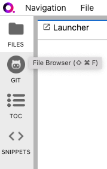

.. _lab_files:

File Browser
=============

The file browser and Files menu enable you to work with files and directories on your system. This includes opening, creating, deleting,
renaming, downloading, copying, and sharing files and directories. To open the file browser, click on the **FILES** tab in the left sidebar
(or use shortcut ``Cmd+Shift+F``).

Open files
-----------

The file system can be navigated by double-clicking on folders in the listing or clicking on the folders at the top of the directory listing.
To open any file, double-click on its name, or drag the file into the main work area to create a new tab.

.. seealso::

    - `Jupyter Lab: Working with Files <https://jupyterlab.readthedocs.io/en/stable/user/files.html#opening-files>`_