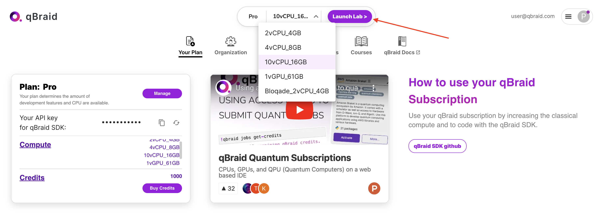
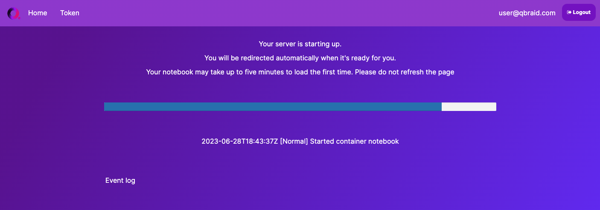
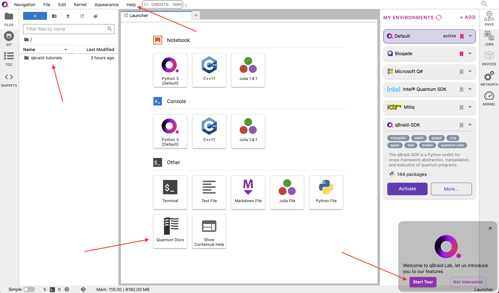
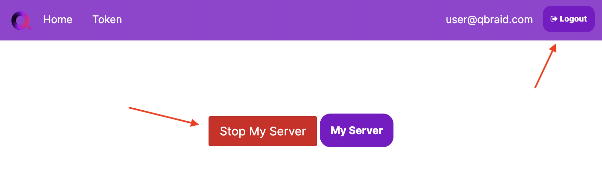
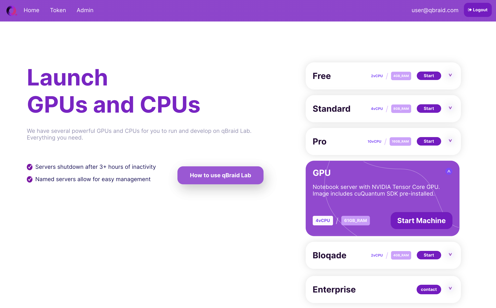

.. _lab_getting_started:

Getting Started
================

This section will walk you through the basics of using the Lab interface and managing your server instance.

Launch Lab
------------

Use the drop-down at the top of your `account page <https://account.qbraid.com>`_ to select a Lab image. All users
have access to the "Free" tier image, which includes 2 virtual CPUs and 4 GB of RAM. `Paid subscription tiers <https://www.qbraid.com/products>`_
include compute options ranging up to 10 virtual CPUs, GPU images, and application specific
images such as `Bloqade <https://queracomputing.github.io/Bloqade.jl/dev/>`_. Once you have selected an image, click **Launch Lab**.

  
|

Depending on its size, pulling an image may take up to 5 minutes the first time. The next time you launch Lab, it will load much more quickly.

  
|

Lab interface
--------------

Once your image is pulled, you will be taken to the qBraid Lab interface. Here are a few helpful resources to get started:

* **Interactive tour**: Click **Start Tour** (bottom right) to begin a guided tour of all of the Lab extensions and their key features.
* **qBraid tutorials**: The ``qbraid-tutorials`` directory (left-sidebar **FILES** tab) contains examples and tutorials for a wide range different quantum software packages. Many of the notebooks contain qBraid instructions and are runnable using the ``Python 3 [Default]`` environment.
* **qBraid Docs**: The **Quantum Docs** extension (bottom middle of Launcher, under **Other**) contains a collection of direct links to documentation pages for many of the most popular quantum software packages.
* **Help drop-down**: The top-bar menu **Help** drop-down contains links to more qBraid user guides, demos, and reference materials.

  
|

Lab server
-----------

The Hub Control Panel is the user interface that provides users with control and management over their individual server instances in the qBraid Lab system.
To access the control panel, go to **File** > **Hub Control Panel**, or navigate to `<https://lab.qbraid.com/hub/home>`_ directly from your browser.

From here, you can perform a number of important actions including **Logout** and **Stop My Server**. Stopping your server instance
will not delete your server, but will stop it from running. Once your server is stopped, you can restart it by clicking **Start My Server**.

  
|

You can then restart Lab using the same image you used previously, or you can select a new image to launch.

  
|