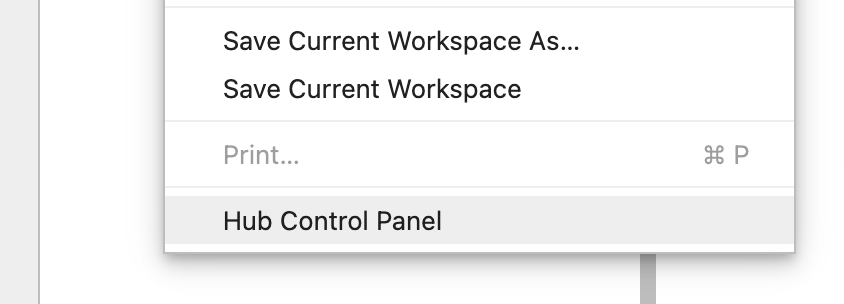

.. _lab_getting_started:

Getting Started
================

This section will walk you through the basics of using the lab interface.

Launching Lab
---------------

Use the drop-down at the top of your `account page <https://account.qbraid.com>`_ to select a Lab image. All users
have access to the "Free" tier image, which includes 2 virtual CPUs and 4 GB of RAM. Paid subscription tiers include
compute options ranging up to 10 virtual CPUs, GPU images, and application specific
images such as `Bloqade <https://queracomputing.github.io/Bloqade.jl/dev/>`_. Once you have selected an image, click **Launch Lab**.

.. image:: ../_static/getting_started/launch_lab.png
    :align: center
    :width: 800px
    :target: javascript:void(0);
  
|

Depending on its size, pulling an image may take up to 5 minutes the first time. Although, the next time you launch Lab, it will load much more quickly.

.. image:: ../_static/getting_started/loading.png
    :align: center
    :width: 800px
    :target: javascript:void(0);
  
|

.. image:: ../_static/getting_started/launcher.png
    :align: center
    :width: 800px
    :target: javascript:void(0);
  
|

  
|

.. image:: ../_static/getting_started/hub_home.png
    :align: center
    :width: 800px
    :target: javascript:void(0);
  
|

.. image:: ../_static/getting_started/hub.png
    :align: center
    :width: 800px
    :target: javascript:void(0);
  
|