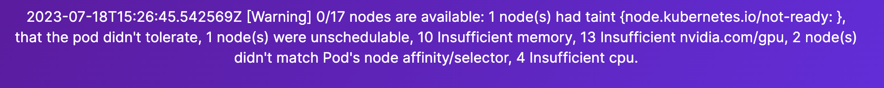
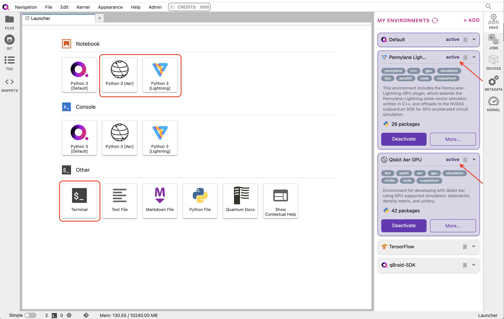
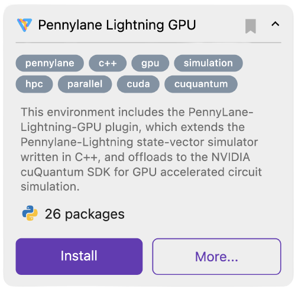
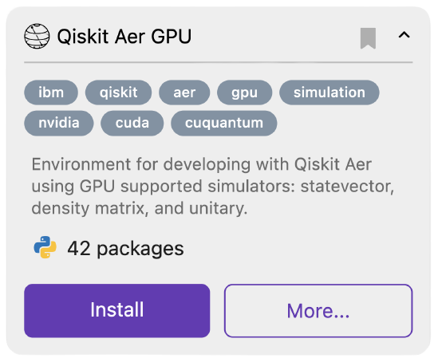

.. _lab_gpu:

GPUs
=======

The qBraid Lab GPU server provides access to an NVIDIA Tesla V100 GPU, and is tailored for researchers and developers requiring
enhanced computational capabilities. This high-performance Lab instance allows users to leverage GPU accelerated circuit simulation,
to explore quantum machine learning applications with GPU-enabled quantum gradients, and more. For *exclusive early access*, join our
`pre-launch waitlist <https://form.typeform.com/to/uRGyqJST?utm_source=xxxxx&utm_medium=xxxxx&utm_campaign=xxxxx&utm_term=xxxxx&utm_content=xxxxx&typeform-source=docs>`_.

Launch GPU instance
--------------------

Use the drop-down at the top of your `account page <https://account.qbraid.com>`_ to select the GPU Lab image, and then click **Launch Lab**.
At the moment, the GPU Lab instance is in beta, so is restricted to users who have been granted early access (see `pre-launch waitlist <https://form.typeform.com/to/uRGyqJST?utm_source=xxxxx&utm_medium=xxxxx&utm_campaign=xxxxx&utm_term=xxxxx&utm_content=xxxxx&typeform-source=docs>`_).
For enterprises and organizations seeking early access, or for other individual inquiries, feel free to `contact us <https://qbraid.com/contact>`_ directly.

|

Upon launching the GPU instance, you may see a warning similar to the following:

The GPU server is designed to auto-scale to maintain performance and availability, and thus, automatically creates additional
pods as required by the workload. This warning message is an expected part of that scaling operation, which should only take a
minute or two. During this time, do not refresh the page. If you encounter a ``500 TimeOutError``, click **Home** in the top-left,
and `re-start your server <getting_started.html#lab-server>`_.

Configuration
---------------

qBraid Lab GPUs instances are configured with the following specification:

+------------------+-------------+
| Provider         | NVIDIA      |
+------------------+-------------+
| GPU Architecture | Volta       |
+------------------+-------------+
| GPU Name         | Telsa V100  |
+------------------+-------------+
| CUDA             | 11.5        |
+------------------+-------------+
| Driver           | 470.182.03  |
+------------------+-------------+

Further information can be retrieved using the `NVIDIA System Management Interface <https://developer.nvidia.com/nvidia-system-management-interface>`_
(``nvidia-smi``) and `NVIDIA CUDA Toolkit <https://developer.nvidia.com/cuda-toolkit>`_ (``nvcc``) command line utilities.

GPU-enabled environments
--------------------------

The GPU Lab image comes pre-configured with the `NVIDIA cuQuantum SDK <https://developer.nvidia.com/cuquantum-sdk>`_ GPU simulator library,
and includes GPU integrations with other popular quantum softwares packages such as Pennylane-Lightning and Qiskit Aer.

|

Pennylane-Lighting
^^^^^^^^^^^^^^^^^^^

`PennyLane <https://docs.pennylane.ai/>`_ is a cross-platform Python library for quantum machine learning, automatic differentiation,
and optimization of hybrid quantum-classical computations. The `PennyLane-Lightning-GPU <https://github.com/PennyLaneAI/pennylane-lightning-gpu>`_ plugin
extends the `Pennylane-Lightning <https://github.com/PennyLaneAI/pennylane-lightning>`_ state-vector simulator written in C++, and offloads to the
NVIDIA cuQuantum SDK for GPU accelerated circuit simulation.

The ``lightning.gpu`` device is an extension of PennyLane's built-in ``lightning.qubit`` device. It extends the CPU-focused
Lightning simulator to run using the NVIDIA cuQuantum SDK, enabling GPU-accelerated simulation of quantum state-vector evolution.

A ``lightning.gpu`` device can be loaded using:

.. code-block:: python

    import pennylane as qml
    dev = qml.device("lightning.qubit", wires=2)

The above device will allow all operations to be performed on the pre-configured CUDA capable GPU. If not
used inside the qBraid GPU instance, or if the cuQuantum libraries are not installed in the given environment,
the device will fall-back to ``lightning.qubit`` and perform all simulation on the CPU.

.. seealso::
    
    - `Pennylane-Lightning-GPU device usage <https://docs.pennylane.ai/projects/lightning-gpu/en/latest/devices.html>`_
    - `qBraid Lab Demo Pennylane-Lightning-GPU <https://github.com/qBraid/qbraid-lab-demo/blob/main/qbraid_lab/gpu/lightning_gpu_benchmark.ipynb>`_

Qiskit Aer
^^^^^^^^^^^

Qiskit is an open-source framework for working with noisy quantum computers at the level of pulses, circuits, and algorithms.
The `Qiskit Aer <https://github.com/Qiskit/qiskit-aer>`_ library provides high-performance quantum computing simulators with
realistic noise models.

On qBraid, the Qiskit Aer GPU environment comes with the ``qiskit-aer-gpu`` package, extending the same
functionality of the canonical ``qiskit-aer`` package, plus the ability to run the GPU supported simulators: statevector,
density matrix, and unitary.

Here is a basic example:

.. code-block:: python

    import qiskit
    from qiskit_aer import AerSimulator

    # Generate 3-qubit GHZ state
    circ = qiskit.QuantumCircuit(3)
    circ.h(0)
    circ.cx(0, 1)
    circ.cx(1, 2)
    circ.measure_all()

    # Construct an ideal simulator
    aersim = AerSimulator(method='statevector', device='GPU')

    # Perform an ideal simulation
    result_ideal = qiskit.execute(circ, aersim).result()
    counts_ideal = result_ideal.get_counts(0)
    print('Counts(ideal):', counts_ideal)
    # Counts(ideal): {'000': 493, '111': 531}