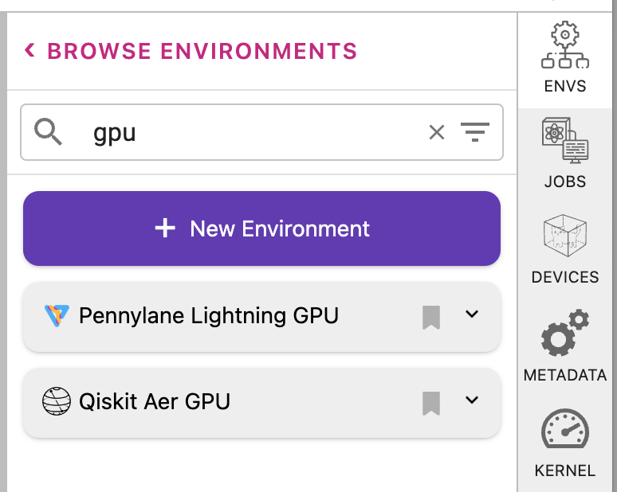

.. _lab_gpu:

GPUs
======= 

The qBraid Lab GPU server provides access to an NVIDIA Tesla T4 GPU, and is tailored for researchers and developers requiring enhanced computational capabilities.
The image comes pre-configured with the NVIDIA cQuantum SDK GPU simulator library, and includes GPU integrations with other popular quantum softwares packages such as
Pennylane-Lightning and Qiskit Aer, each working out-of-the-box. This high-performance Lab instance allows users to leverage GPU accelerated circuit simulation, to
explore quantum machine learning applications with GPU-enabled quantum gradients, and much more! 🧬 💻

For exclusive early access, join our `pre-launch waitlist <https://form.typeform.com/to/uRGyqJST?utm_source=xxxxx&utm_medium=xxxxx&utm_campaign=xxxxx&utm_term=xxxxx&utm_content=xxxxx&typeform-source=docs>`_ 🗒️

Launch GPU instance
--------------------

.. image:: ../_static/gpu/gpu_launch.png
    :align: center
    :width: 700px
    :target: javascript:void(0);

|

Scaling Up
^^^^^^^^^^^

.. image:: ../_static/gpu/gpu_scaling_up.png
    :align: center
    :width: 700px
    :target: javascript:void(0);

|

System
-------

.. image:: ../_static/gpu/gpu_lab_launcher.png
    :align: center
    :width: 700px
    :target: javascript:void(0);

|

+------------------+-------------+
| Provider         | NVIDIA      |
+------------------+-------------+
| Architecture     | Turing      |
+------------------+-------------+
| Name             | Telsa T4    |
+------------------+-------------+
| CUDA             | 11.5        |
+------------------+-------------+
| Driver           | 470.182.03  |
+------------------+-------------+

GPU Libraries
---------------

cuQuantum SDK
^^^^^^^^^^^^^^

Pennylane Lighting
^^^^^^^^^^^^^^^^^^^

|

.. image:: ../_static/gpu/gpu_pennylane_lightning.png
    :align: right
    :width: 400px
    :target: javascript:void(0);

|

Qiskit Aer
^^^^^^^^^^^

|

.. image:: ../_static/gpu/gpu_qiskit_aer.png
    :align: right
    :width: 400px
    :target: javascript:void(0);

|