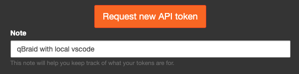
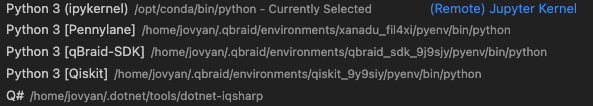

.. _lab_integrations:

Integrations
=============

Visual Studio Code
-------------------

|

`Connecting`_ your qBraid Lab account to `Visual Studio Code`_ enables `running Jupyter Notebooks`_
on your local machine while still accessing the pre-packaged environments, compute resources, and
other softwares and API's available through qBraid Lab.

Get access token
^^^^^^^^^^^^^^^^^

1. Log in to `lab.qbraid.com <https://lab.qbraid.com>`_.

2. Access your *Control Panel* by clicking **File** --> **Hub Control Panel**.

.. image:: ../_static/integrations/0_file_control_panel.png
    :align: center
    :width: 400px
    :target: javascript:void(0);

|

3. Navitage to the 'Token' page by clicking **Token** in the top bar.

|

4. Type in a description for the new token you want, and click **Request new API Token**.

|

5. Copy your token and keep it somewhere safe. You should treat this like a password to your
qBraid Lab account, and revoke it from the same page when you are no longer using it.

.. image:: ../_static/integrations/3_copy_token.png
    :align: center
    :width: 500px
    :target: javascript:void(0);

|

Connect VS Code to Lab
^^^^^^^^^^^^^^^^^^^^^^^

1. Open the command palette in VS Code (``Cmd+Shift+P`` on MacOS, ``Ctrl+Shift+P`` elsewhere).

2. Select **Jupyter: Specify Jupyter Server for Connections**, and then select **Existing**.

.. image:: ../_static/integrations/4_jupyter_server.png
    :align: center
    :width: 600px
    :target: javascript:void(0);

|

.. image:: ../_static/integrations/5_existing_uri.png
    :align: center
    :width: 600px
    :target: javascript:void(0);

|

3. Construct your notebook server URL with the following template: ``https://lab.qbraid.com/user/<your-lab-username>/?token=<your-token>``.

.. image:: ../_static/integrations/6_example_user.png
    :align: center
    :width: 600px
    :target: javascript:void(0);

|

Your Lab username is generated from the email address associated with your qBraid account.

.. note::
    If your account email uses special characters, your Lab username might be escaped, i.e. modified, from your raw email address.
    You can verify this by looking at the URL you get after launching Lab; your username will be appear right after ``.../user/``.

4. Create or open a new notebook, and select a notebook kernel from any of your installed and active qBraid Lab environments.

.. image:: ../_static/integrations/7_notebook_kernel.png
    :align: center
    :width: 600px
    :target: javascript:void(0);

|

|

.. seealso::
    
    - `Jupyter Blog <https://blog.jupyter.org/connect-to-a-jupyterhub-from-visual-studio-code-ed7ed3a31bcb>`_

.. _Visual Studio Code: https://code.visualstudio.com/
.. _running Jupyter Notebooks: https://code.visualstudio.com/docs/datascience/jupyter-notebooks
.. _Connecting: https://code.visualstudio.com/docs/datascience/jupyter-notebooks#_connect-to-a-remote-jupyter-server

