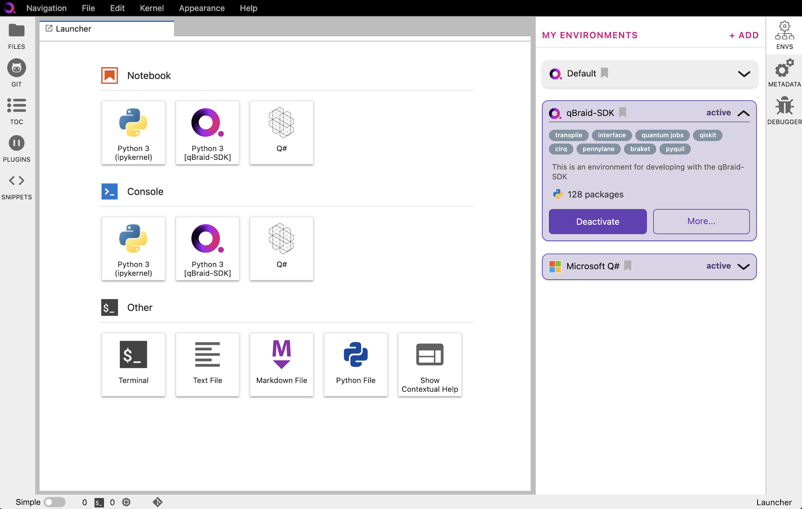

.. _lab_kernels:

Kernels
=========

Add/remove kernel
-------------------

The IPython kernel is the Python execution backend for Jupyter.

Under **My Environments**, choose the environment, and expand its pannel.
Click **Activate** to activate the environment and create an associated ipykernel.

.. image:: ../_static/notebooks/kernel_activate.png
    :width: 90%
    :alt: Add kernel
    :target: javascript:void(0);

|

Once active, click **Deactivate** to deactivate an environment, and remove its ipykernel
from the launcher.

|