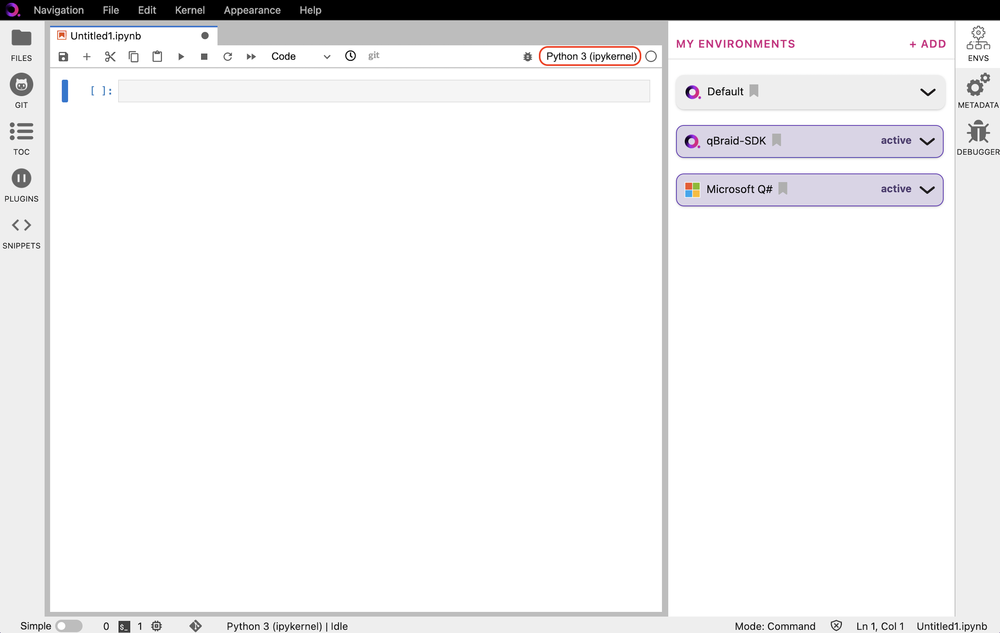

.. _lab_kernels:

Kernels
========

The IPython kernel is the Python execution backend for Jupyter.

Add/remove kernels
-------------------

Under **My Environments**, choose the environment, and expand its pannel.
Click **Activate** to activate the environment and create an associated ipykernel.

.. image:: ../_static/kernels/kernel_activate.png
    :align: center
    :width: 800px
    :target: javascript:void(0);

|

Once active, click **Deactivate** to deactivate an environment, and remove its ipykernel
from the launcher.

.. image:: ../_static/kernels/kernel_deactivate.png
    :align: center
    :width: 800px
    :target: javascript:void(0);

|

Switch notebook kernel
-----------------------

In the Launcher tab, under **Notebooks**, clicking on an ipykernel associated with an
activated environment will automatically launch a Jupyter notebook (``.ipynb`` file)
using that kernel. In the upper-right of the newly created notebook, you can see
which kernel is in use.

|

Clicking on the name of the current kernel, as circled above, will open the kernel selector, and allow you
switch to any other active kernel.

.. image:: ../_static/kernels/kernel_switch.png
    :align: center
    :width: 800px
    :target: javascript:void(0);

|

.. seealso::

    The notebook document format used in qBraid Lab is the same as in the classic Jupyter Notebook.
    For more on how to use the Jupyter Notebooks, see `Jupyter Notebook readthedocs <https://jupyter-notebook.readthedocs.io/en/stable/>`_.