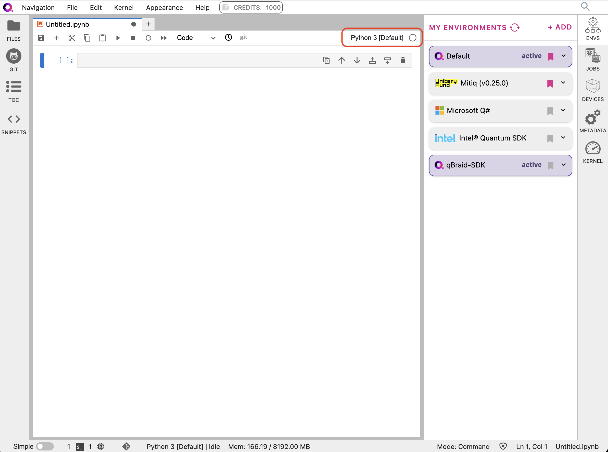
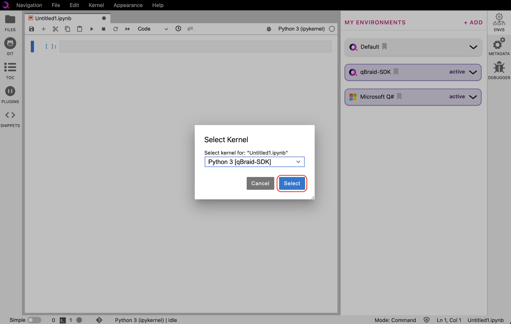
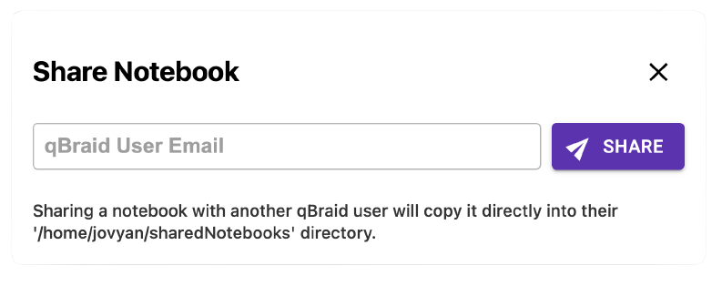

.. _lab_notebooks:

Notebooks
==========

Jupyter Notebooks (``.ipynb`` files) are a community standard for communicating and performing interactive computing. They are documents that combine live runnable
code with narrative text (Markdown), equations (LaTeX), images, interactive visualizations and other rich output.

qBraid Lab provides an interface to create and interact with Jupyter Notebooks, and includes a number of additional key features
and integrations to enhance the quantum developer's experience.

Create notebook
----------------

Create a notebook by clicking the ``+`` button in the file browser and then selecting a kernel in the new Launcher tab.
In the Launcher tab, under **Notebooks**, clicking on an ipykernel associated with an activated environment will automatically
launch a Jupyter notebook (``.ipynb`` file) using that kernel.

Switch notebook kernel
-----------------------

In the upper-right of any open notebook, you can see which kernel is in use.

|

Clicking on the name of the current kernel, as circled above, will open the kernel selector, and allow you
switch to any other active kernel.

|

Share notebook
---------------

Collaborate and share your work with other qBraid users via the "Share notebook" feature:

.. note::

    Sharing notebooks is available only in the Standard/Pro tiers. See `subscriptions <https://www.qbraid.com/pricing>`_ for more information.

1. Open the notebook that you would like to share (see `Opening files <https://jupyterlab.readthedocs.io/en/latest/user/files.html#opening-filess>`_).
2. Click **File** > **Share Notebook**
3. Enter the email address associated with the account of any another qBraid user, and click **Share**.

|share|

The notebook will then be copied directly into that user's ``$HOME/sharedNotebooks`` directory in their qBraid Lab file system.
This ``sharedNotebooks`` directory will be automatically created at the time the notebook is shared, if it does not already exist.

.. seealso::

    The notebook document format used in qBraid Lab is the same as in the classic Jupyter Notebook.
    For more on how to use the Jupyter Notebooks, see `Jupyter Notebooks <https://jupyter-notebook.readthedocs.io/en/stable/>`_
    and `Jupyter Lab: Notebooks <https://jupyterlab.readthedocs.io/en/stable/user/notebook.html>`_.