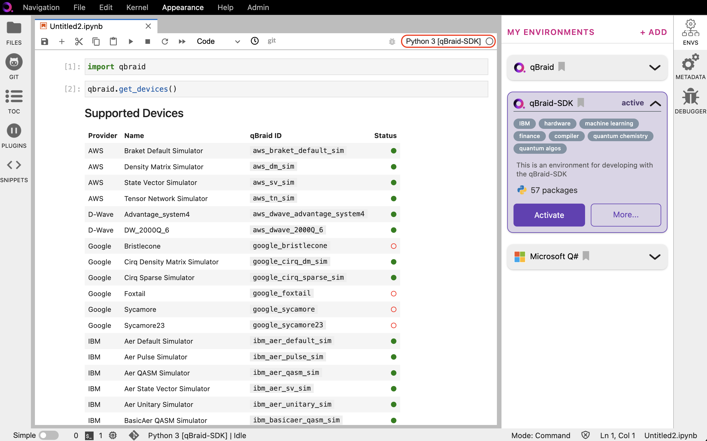

.. _lab_notebooks:

Notebooks
==========

Creating a notebook
--------------------

1. :ref:`Activate <lab_envs_activate>` the environment you wish to use in the notebook.
This will create an ipykernel for that environment, if one does not already exist.

2. In your current Launcher tab, under **Notebooks**, click on the ipykernel associated with
the activated environment. This will launch a new Jupyter notebook (``.ipynb`` file) using
that kernel.

.. image:: ../_static/setup/3_create.png
    :align: center
    :width: 800px
    :target: javascript:void(0);

|

3. In the upper-right of the newly created notebook, check that the active kernel was set correctly.
If a different kernel is activated, click on its name to open the kernel selector.

|

.. seealso::

    The notebook document format used in qBraid Lab is the same as in the classic Jupyter Notebook.
    For more on how to use the Jupyter Notebooks, see `Jupyter Notebook readthedocs <https://jupyter-notebook.readthedocs.io/en/stable/>`_.