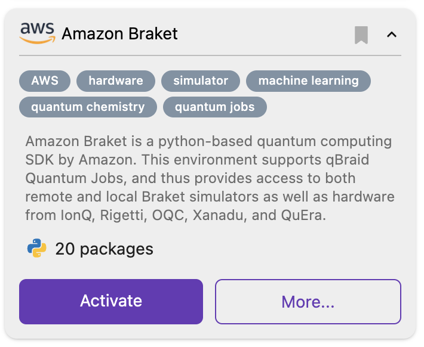

.. _lab_quantum_jobs:

Quantum Jobs
=============

qBraid Quantum Jobs give Lab users direct access to all `Amazon Braket supported devices <https://docs.aws.amazon.com/braket/latest/developerguide/braket-devices.html>`_
and `IBM Quantum open systems <https://www.ibm.com/quantum/access-plans>`_ with no additional access keys required. This includes access to 15 QPU devices from
IonQ, Oxford Quantum Circuits, QuEra, Rigetti, Xanadu, and IBM, as well as 8 on-demand simulators from AWS and IBM.

Credits
--------

Each time you run a program on a QPU or on-demand simulator using qBraid Quantum Jobs, credits are subtracted from your account according to the cost of the job.
The cost is calculated using the per-shot / per-task / per-second fee(s) from `Amazon Braket pricing <https://aws.amazon.com/braket/pricing/>`_ or
`Qiskit Runtime pricing <https://www.ibm.com/quantum/access-plans>`_, with no mark-up.

Each qBraid credit is worth $.01 USD, so an Amazon Braket task costing $3.80 would subtract 380 credits from your qBraid balance. Credits can be `purchased <https://account.qbraid.com/billing.>`_
from your account page, or `redeemed <account.html#add-access-key>`_ using an access key. You can check your current credit balance on your `account page <https://account.qbraid.com/billing.>`_,
in the ``QJOBS`` sidebar on Lab, or using the `CLI <../cli/jobs-get-credits.html>`_:

.. code-block::

    $ qbraid jobs get-credits

Which environments?
--------------------

Environments listed in the Environment Manager with the ``quantum jobs`` tag have pre-configured support for qBraid Quantum Jobs.

You can also use the CLI to see which of your installed environments support Quantum Jobs with the `qbraid envs list <../cli/envs-list.html>`_ command.

Environments with the ``jobs`` keyword listed before their path support qBraid Quantum Jobs.
Green or red highlighting over the ``jobs`` keyword (not pictured) indicates whether jobs are enabled or disabled for that environment.

.. code-block::
   
    $ qbraid envs list
    # installed environments:
    #
    qsharp                         /opt/.qbraid/environments/qsharp_b54crn
    default                  jobs  /opt/.qbraid/environments/qbraid_000000
    qiskit                   jobs  /home/jovyan/.qbraid/environments/qiskit_9y9siy
    amazon_braket            jobs  /home/jovyan/.qbraid/environments/aws_braket_kwx6dl
    custom_env                     /home/jovyan/.qbraid/environments/custom_env_lj3zlt

qBraid Quantum Jobs are not limited to environments with pre-configured support. You can `add <../cli/jobs-add.html>`_ Quantum Jobs to any environment that has Amazon Braket or Qiskit installed:

.. code-block::

   $ qbraid jobs add [env_name]

Enable/disable
---------------

To use Quantum Jobs in an environment, they must be `enabled <../cli/jobs-enable.html>`_:

.. code-block::

    $ qbraid jobs enable [env_name]

You can also enable Quantum Jobs from inside a notebook using the ``!`` operator. This extra character, put at the beginning of the command, indicates that what you've entered is a bash command and not Python code.

To `disable <../cli/jobs-disable.html>`_ Quantum Jobs and run programs using your own AWS / IBM credentials, enter

.. code-block::

    $ qbraid jobs disable [env_name]

To reset your AWS credentials, follow instructions `Quick configuration with aws configure <https://docs.aws.amazon.com/cli/latest/userguide/cli-configure-quickstart.html#cli-configure-quickstart-config>`_.
To reset your IBM credentials, follow instructions `Qiskit IBM Quantum Provider setup <https://github.com/Qiskit/qiskit-ibm-provider#provider-setup>`_.

 
Manage
-------

Before executing/submitting your quantum program, make sure that your notebook kernel matches the correct environment, and
that Quantum Jobs are enabled. In the example below, a two-qubit bell circuit program was submitted to IonQ using 100 shots.
From the Quantum Jobs sidebar, you can view the details of your submitted jobs, monitor the status of each job, and track your credits.
In this example, the job cost ~130 qBraid credits, equivalent to $1.30 USD.

.. image:: ../_static/jobs/jobs_ionq.png
    :align: center
    :width: 800px
    :target: javascript:void(0);

At any time, it's now incredibly easy to retrieve the Job ID, recreate the ``AwsQuantumTask`` object in a new program, and get the results:

.. code-block:: python

    from braket.aws import AwsQuantumTask

    # Job ID (arn) copied over from sidebar
    task = AwsQuantumTask(arn="arn:aws:braket:us-east-1:..." )

    task.result()
    ...

On qBraid, the devices you can access are not restricted by your choice of programming framework. Target any of our 20+ supported QPUs and simulators
from Qiskit, Amazon Braket, Cirq, pyQuil, or OpenQASM 2 using the `qBraid SDK <../sdk/devices.html>`_.

.. seealso::

    - `Using access codes to connect to quantum devices on qBraid | Demo <https://youtu.be/K4vb2fzmSZQ>`_
    - `qBraid Quantum Jobs Lab Demo Notebook <https://github.com/qBraid/qbraid-lab-demo/blob/main/qbraid_quantum_jobs.ipynb>`_
