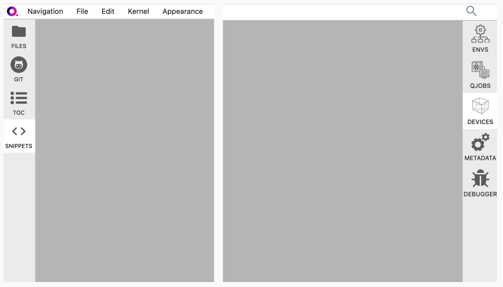

.. _lab_troubleshoot:

Troubleshooting
================

If you encounter an error that isn't included on this page or if the solution provided doesn't work, please
`reach out to us on Discord <https://discord.gg/gwBebaBZZX>`_, email us at request@qbraid.com, or
`open a bug report <https://github.com/qbraid/community/issues/new?assignees=&labels=bug&template=bug_report.md>`_.

Error launching Lab
---------------------

If you get one of the following errors while launching Lab,

- ``400: Bad Request``
- ``500: Internal Server Error``
- ``503: Service Unavailable``
- ``Spawn failed``

your qBraid Lab server failed to start. Follow the prompts on the screen, or if none are given,
return to https://account.qbraid.com, and click **Launch Lab** to try again.

Lab server errors
------------------

If you get one of the following errors from inside Lab, 

- ``Service unavailable or unreachable``
- ``File Save Error``

you need to restart your qBraid Lab server. For these types of errors, refreshing the page won't work.
Instead, you need to pull down a new Lab image, which can only be done from the qBraid Hub Control Panel:

Go to **File** > **Hub Control Panel**, or type https://lab.qbraid.com/hub/home directly into your
browser. From there, click **Stop My Server** > **Start My Server** > **Launch Server**, and wait for Lab to reload.

ModuleNotFoundError
--------------------

While running a notebook, if you get a ``ModuleNotFoundError`` after an import statement:

1. Check to make sure you are using the correct notebook kernel for your environment,
see `Switch notebook kernel <notebooks.html#switch-notebook-kernel>`_.

2. If you are using the correct kernel, the package you are trying to import may not be installed
in that environment. See `Install new package <environments.html#install-new-package>`_.

NoRegionError
--------------

If you are running an Amazon Braket notebook and get a ``NoRegionError``, it's likely that you have not enabled Quantum Jobs. Run

.. code-block::

  $ qbraid jobs enable [env_name]
  
and restart your kernel, and try running the notebook again. If you are using the Amazon Braket environment, ``env_name`` is simply ``amazon_braket``.

.. seealso::

    -  `Quantum Jobs <quantum_jobs.html>`_

Extension sidebar errors
--------------------------

Under rare circumstances, you may load qBraid Lab to find that Code Snippets, Quantum Devices, or another extension does not show up in the sidebar,
or that an extension only displays a solid grey, red, or other color when expanded, like below:

Most often, this means that your cookies were not correctly passed from your Account page to your Lab page. To fix this error, open `account.qbraid.com <https://account.qbraid.com>`_,
from a new tab or window, login back in, and click **Launch Lab**. Once Lab reloads, all of your extensions should be visible again.

.. note::
  For certain browser types (e.g. Safari) these steps may not resolve the error. In this case, please reach out to us via `Discord <https://discord.gg/gwBebaBZZX>`_,
  `email <request@qbraid.com>`_, or `GitHub <https://github.com/qbraid/community/issues/new?assignees=&labels=bug&template=bug_report.md>`_ for further instructions and
  assistance.

OpenSSL AttributeError
-----------------------

Depending on the environment you're using, executing

.. code-block:: python

  from braket.aws import AwsDevice

may raise ``AttributeError: module 'lib' has no attribute 'OpenSSL_add_all_algorithms'``. If this happens to you, don't worry! This is simply a result
of an outdated ``pyOpenSSL`` version. Upgrade to the latest version and the problem should be resolved:

.. code-block::

  pip install --upgrade pyOpenSSL