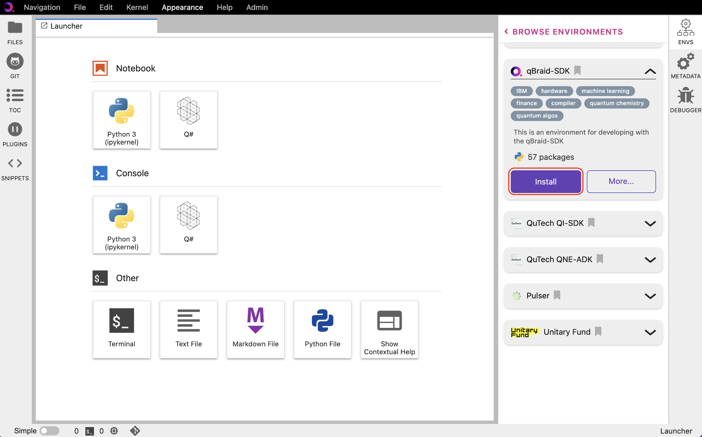
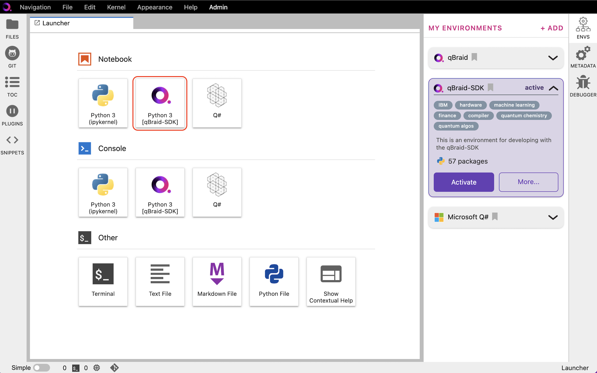

Installation & setup
=====================

First, navigate to `<https://lab.qbraid.com>`_ and login, or create an account.

Open environment manager
-------------------------

- Once in the qBraid-Lab console, click **Envs** in the right-sidebar to expand the
  environment manager. **My Environments** are your currently installed environments.

- The qBraid base environment and Microsoft Q# environment are installed by default.

- Click **Add** to see the other environments available to install.

.. image:: _static/setup0.png
    :align: center
    :width: 800px
    :target: javascript:void(0);

|

Install environment
---------------------

- Expand the **qBraid-SDK** environment pannel, and click **Install**.

- Once the installation has started, the pannel is moved to the **My Environments** tab.

- Click **Browse Environments** to return to the **My Environments** tab.

|

Activate environment
---------------------

- Expand the **qBraid-SDK** pannel under **My Environments**.

- Once installation is complete, the action button will switch from **Installing...** to **Activate**.

- Click **Activate** to activate the environment and create an associated ipykernel.

.. image:: _static/setup2.png
    :align: center
    :width: 800px
    :target: javascript:void(0);

|

Create notebook instance
-------------------------

- Select the **Python 3 [qBraid-SDK]** kernel under **Notebooks** in your
  current Launcher tab to create a new Jupyter notebook (``.ipynb`` file)
  with this set as the start preferred kernel.

|

Verify kernel
--------------

- In the upper-right of the newly created notebook, check that 
  **Python 3 [qBraid-SDK]** is the active kernel. If a different
  kernel is activated, click on its name to open the kernel selector.

- Run ``import qbraid`` to verify that installation and
  kernel activation were successful.

.. image:: _static/setup4.png
    :align: center
    :width: 800px
    :target: javascript:void(0);

|

The notebook document format used in qBraid-Lab is the same as in the classic Jupyter Notebook.
For more on how to use the JupyterLab interface, see `JupyterLab Documentaion <https://jupyterlab.readthedocs.io/>`_.