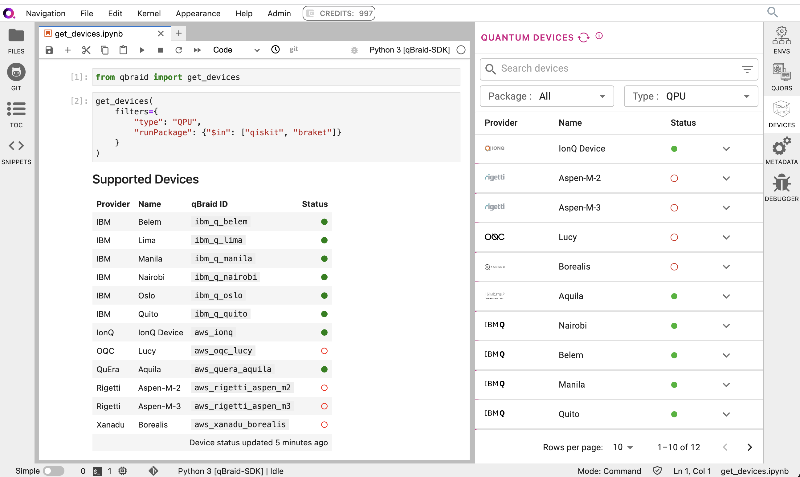

.. _sdk_devices:

Devices
=========

In this module, you will learn how to use the qBraid SDK to interface with
quantum backends. We will demonstrate how to construct queries and search
for available devices using the ``qbraid.get_devices`` function, and
overview how to execute circuits using the ``qbraid.providers`` module.

Unified Device Search
----------------------

The ``get_devices`` function provides a unified quantum device search. It returns a complete list
of all quantum backends available through Qiskit, Cirq, and Amazon Braket, along with the "status" of
each device, i.e. ``ONLINE`` or ``OFFLINE``.

.. code-block:: python

    from qbraid import get_devices

    get_devices()

There a number of query options available to help filter your search.
For example, to find simulators available through AWS or IBM:

.. code-block:: python

    get_devices(
        filters={
            "qbraid_id": {"$regex": "sim"},
            "vendor": {"$in": ["AWS", "IBM"]},
        }
    )

To search for all gate-based QPUs with at least 7 qubits:

.. code-block:: python

    get_devices(
        filters={
            "paradigm": "gate-based",
            "type": "QPU",
            "numberQubits": {"$gte": 7},
        }
    )

Or to find all qiskit backends that are online and have less than 50 pending jobs:

.. code-block:: python

    get_devices(
        filters={
            "runPackage": "qiskit",
            "pendingJobs": {"$lte": 50},
            "status": "ONLINE",
        }
    )

If run in Jupyter, the call above will return a display table similar to the following:

As seen above, qBraid Lab has a built-in Quantum Devices sidebar extension that returns the
same data as the ``get_devices`` function in an intuitive UI with custom search and filters.

In the lower-right of the table IPython table is the time ellapsed since the last device status
update. Device status labels can be manually refreshed by setting ``refresh=True``:

.. code-block:: python

    get_devices(refresh=True)

If run in the Python Shell, device data is returned in a similar format.

.. code-block:: python

    >>> from qbraid import get_devices
    >>> get_devices(filters={"vendor": "AWS", "type": "QPU"}, refresh=True)
    Device status updated 0 minutes ago

    Device ID                           Status
    ---------                           ------
    aws_ionq_aria1                      ONLINE
    aws_oqc_lucy                        ONLINE
    aws_quera_aquila                    ONLINE
    aws_rigetti_aspen_m2                OFFLINE
    aws_rigetti_aspen_m3                ONLINE
    aws_xanadu_borealis                 ONLINE

Each supported device is associated with its own qBraid ID. The next section will cover
how this value is used to wrap the quantum backends / device objects of various types.

.. seealso::

    For more on advanced ``filters`` options and syntax, see `Query Selectors`_.
    

.. _Query Selectors: https://docs.mongodb.com/manual/reference/operator/query/#query-selectors

Device Wrapper
----------------

Given a ``qbraid_id`` retrieved from ``get_devices``, a ``qbraid.providers.QuantumDevice``
object can be created as follows:

.. code-block:: python

    from qbraid import device_wrapper

    qbraid_id = 'aws_oqc_lucy'  # as an example

    qdevice = device_wrapper(qbraid_id)

From here, class methods are available to get information about the device,
execute quantum programs (to be covered in the next section), access the
wrapped device object directly, and more.

.. code-block:: python

    >>> qdevice.metadata()
    {'id': 'arn:aws:braket:eu-west-2::device/qpu/oqc/Lucy',
    'name': 'Lucy',
    'provider': 'Oxford',
    'vendor': 'AWS',
    'numQubits': 8,
    'deviceType': 'QPU',
    'status': 'ONLINE',
    'queueDepth': 9,
    ...,
    ...}
    >>> type(qdevice._device)
    braket.aws.aws_device.AwsDevice

Executing Circuits
-------------------

Each ``QuantumDevice`` is equipped with a ``run`` method, which extends the
wrapped object's native ``execute``, ``sample``, ``run``, or equivalent circuit
execution method. This abstraction allows the user to pass a quantum circuit built
using any qbraid-supported frontend to the ``run`` method of the wrapped device.

.. code-block:: python
    
    from qiskit import QuantumCircuit
    
    def circuit0():
        circuit = QuantumCircuit(2)
        circuit.h(0)
        circuit.cx(0,1)
        return circuit

.. code-block:: python

    from cirq import Circuit, LineQubit, ops

    def circuit1():
        q0, q1 = LineQubit.range(2)
        circuit = Circuit(ops.H(q0), ops.CNOT(q0, q1))
        return circuit

.. code-block:: python

    >>> qiskit_circuit = circuit0()
    >>> cirq_circuit = circuit1()
    >>> qjob0 = qdevice.run(qiskit_circuit)
    >>> qjob1 = qdevice.run(cirq_circuit)

Above, I defined two quantum programs, one using qiskit and the other using cirq, and
executed each on Oxford Quantum Circuit's Lucy QPU, made available through Amazon Braket.

Example Flow: Least Busy QPU
------------------------------

In this section, we'll piece together a workflow example, starting by using the
``ibm_least_busy_qpu`` function to get the ``qbraid_id`` of the IBMQ QPU with the
least number of queued quantum jobs.

.. code-block:: python

    >>> from qbraid.providers.ibm import ibm_least_busy_qpu
    >>> qbraid_id = ibm_least_busy_qpu()
    >>> qdevice = device_wrapper(qbraid_id)
    >>> qdevice.name
    'Nairobi'
    >>> qdevice.status()
    <DeviceStatus.ONLINE: 0>

After applying the device wrapper and verifying the device is online, we're ready
to submit a job. This time, we'll use a Cirq circuit as the ``run`` method input.

.. code-block:: python

    >>> from qbraid.interface import random_circuit
    >>> cirq_circuit = random_circuit("cirq", num_qubits=qdevice.num_qubits)
    >>> qdevice.queue_depth()
    4
    >>> qjob = qdevice.run(cirq_circuit)
    >>> qjob.status()
    <JobStatus.QUEUED: 1>
    >>> qdevice.queue_depth()
    5

For fun, we the set number of qubits used in the random circuit equal to the number of
qubits supported by the backend. We then checked the backend's number of pending jobs,
and saw the number increase by one after submitting our job.

Summary
--------

The device layer of the qBraid SDK enables users to execute quantum circuits of
any ``qbraid.QPROGRAM_TYPES`` on any simulator or QPU returned by
``qbraid.get_devices``. Filter your search to the specifications of your task,
identify a device, and execute your program through a consistent three-step protocol:

1. Get qbraid device ID
2. Apply device wrapper
3. Execute program via ``run`` method
