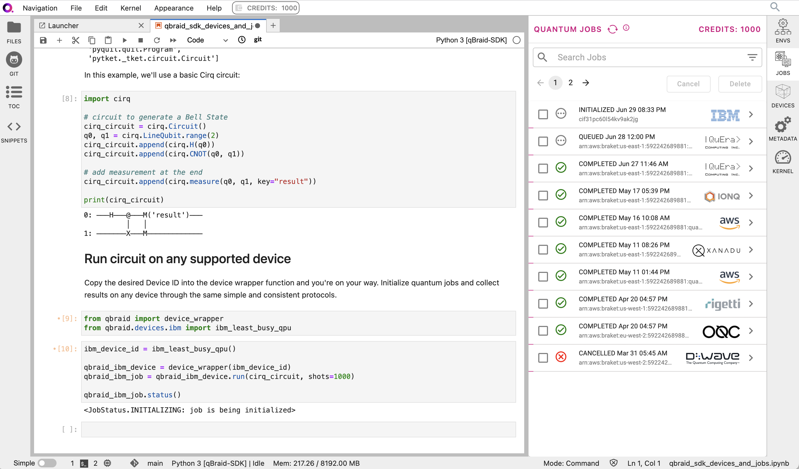

.. _sdk_jobs:

Jobs
=====

In this module, you will learn how to use the qBraid SDK to manage
your quantum jobs.

The `device module <./devices.html>`_ illustrated how qBraid device wrappers can
be used execute circuits on quantum backends. Using the OQC Lucy QPU as our example
target backend, the procedure was as follows:

.. code-block:: python

    >>> from qbraid import device_wrapper
    >>> qbraid_id = 'aws_oqc_lucy'
    >>> qdevice = device_wrapper(qbraid_id)
    >>> qjob = qdevice.run(circuit)
    >>> type(qjob)
    qbraid.providers.aws.job.BraketQuantumTaskWrapper

Invoking the ``run`` method of a qBraid ``QuantumDevice`` returns a qBraid
``QuantumJob``. Through a unified set of methods and attributes, this class
provides access to data about the quantum jobs executed across any qBraid supported
backend. You can also directly access the wrapped "job-like" object using the
``_job`` attribute.

.. code-block:: python

    >>> type(qjob._job)
    braket.aws.aws_quantum_task.AwsQuantumTask

Check the status of your quantum job using the ``status`` method:

.. code-block:: python

    >>> qjob.status()
    <JobStatus.QUEUED: 1>
    
Each quantum job executed through the qBraid SDK is assigned its own
unique job ID.

.. code-block:: python

    >>> qjob.id
    aws_oqc_lucy-exampleuser-qjob-xxxxxxxxxxxxxxxxxxxx

You can use the ``get_jobs`` function to a return a list of your previously
submitted quantum jobs, along with the status of each. A number of filtering options
are available to help narrow your search. Query syntax is equivalent to that
of the ``get_devices`` `unified device search <./devices.html#unified-device-search>`_.
By default, ``get_jobs`` returns the 10 most recently submitted jobs matching your search.

.. code-block:: python

    >>> from qbraid import get_jobs
    >>> get_jobs(filters={"qbraidDeviceId": "aws_oqc_lucy"})
    Displaying 10 most recent jobs matching query:

    Job ID                                                  Submitted                 Status
    ------                                                  ---------                 ------
    aws_oqc_lucy-exampleuser-qjob-xxxxxxxxxxxxxxxxxxxx      2023-05-21T21:13:48.220Z  RUNNING
    aws_oqc_lucy-exampleuser-qjob-yyyyyyyyyyyyyyyyyyyy      2023-04-15T11:09:56.783Z  COMPLETED
    ...

This job ID can be used to reinstantiate a qBraid ``QuantumJob`` object at any
time, and even in a seperate program, with no loss of information.

.. code-block:: python

    >>> from qbraid import job_wrapper
    >>> saved_job_id = 'aws_oqc_lucy-exampleuser-qjob-xxxxxxxxxxxxxxxxxxxx'
    >>> qjob = job_wrapper(saved_job_id)

Once the quantum job is complete, use the ``result`` method to gather the result:

.. code-block:: python

    >>> qjob.wait_for_final_state()
    >>> qjob.status()
    <JobStatus.COMPLETED: 6>
    >>> qresult = qjob.result()

Jobs submitted through the SDK are organized in the qBraid Lab Quantum Jobs Sidebar:

The next module will go in depth on qBraid SDK quantum results.