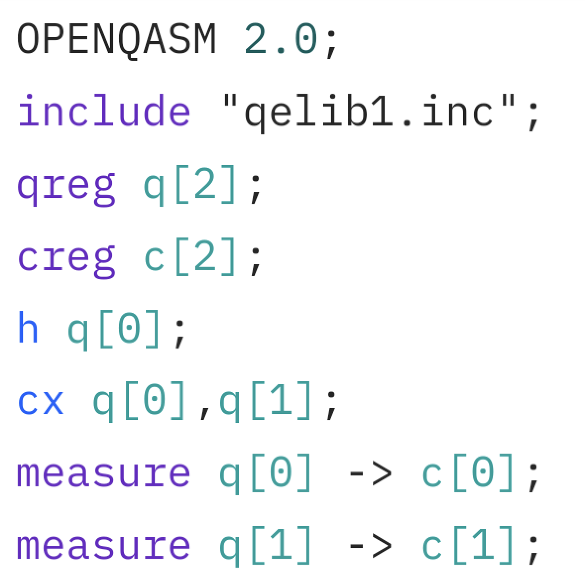

.. _sdk_overview:

Overview
=========

.. raw:: html
   
   <h1 style="text-align: center">
      
       qBraid
       | SDK
   </h1>
   

      A Python toolkit for cross-framework abstraction, transpilation, and execution of quantum programs.
   

:Release: |release|

Features
---------

- *Unified quantum frontend interface*. **Transpile** quantum circuits between supported packages. Leverage the capabilities of multiple frontends through **simple, consistent protocols**.

..

- *Build once, target many*. **Create** quantum programs using your preferred circuit-building package, and **execute** on any backend that interfaces with a supported frontend.

..

- *Benchmark, compare, interpret results*. Built-in **compatible** post-processing enables comparing results between runs and **across backends**.

Installation
-------------

For the best experience, install the qBraid SDK on `lab.qbraid.com <https://lab.qbraid.com>`_.
Login (or create an account) on `account.qbraid.com <https://account.qbraid.com/v2>`_ and then
follow the steps to `install an environment <../lab/environments.html#install-environment>`_.
Using the SDK on qBraid Lab means direct, pre-configured access to all
`Amazon Braket supported devices <https://docs.aws.amazon.com/braket/latest/developerguide/braket-devices.html>`_
and `IBM Quantum open systems <https://www.ibm.com/quantum/access-plans>`_
with *no additional access keys or API tokens required*. See `qBraid Quantum Jobs <../lab/quantumjobs.html>`_ for more.

The qBraid-SDK, and all of its dependencies, can also be installed using `pip <https://pypi.org/project/qbraid/>`_:

.. code-block:: bash

   pip install qbraid

If using locally, follow linked instructions to configure your `qBraid <https://github.com/qBraid/qBraid#local-account-setup>`_,
`AWS <https://github.com/aws/amazon-braket-sdk-python#boto3-and-setting-up-aws-credentials>`_,
and `IBMQ <https://github.com/Qiskit/qiskit-ibm-provider#provider-setup>`_ credentials.

Usage
------

Construct a quantum program of any supported program type:

.. code-block:: python
   
   >>> from qbraid import QPROGRAM_LIBS
   >>> from qbraid.interface import random_circuit
   >>> QPROGRAM_LIBS
   ['braket', 'cirq', 'qiskit', 'pyquil', 'pytket', 'qasm2', 'qasm3']
   >>> circuit = random_circuit("qiskit", num_qubits=1, measure=True)

Search for quantum backend(s) on which to execute your program:

.. code-block:: python

   >>> from qbraid import get_devices
   >>> from qbraid.api import ibm_least_busy_qpu
   >>> get_devices(filters={"architecture": {"$regex": "superconducting"}, "vendor": "AWS"})
   Device status updated 0 minutes ago

   Device ID                           Status     
   ---------                           ------
   aws_oqc_lucy                        ONLINE        
   aws_rigetti_aspen_m2                OFFLINE
   aws_rigetti_aspen_m3                ONLINE
   
   >>> ibm_least_busy_qpu()
   ibm_q_perth

Apply the device wrapper and send your quantum jobs:

.. code-block:: python

   >>> from qbraid import device_wrapper
   >>> jobs  = []
   >>> qbraid_ids = ['aws_oqc_lucy', 'ibm_q_perth']
   >>> for device in qbraid_ids:
   ... qdevice = device_wrapper(device)
   ... qjob = qdevice.run(circuit, shots=1000)
   ... jobs.append(qjob)

List your submitted jobs and view their status:

.. code-block:: python

   >>> from qbraid import get_jobs
   >>> get_jobs(filters={"numResults": 2})
   Displaying 2 most recent jobs matching query:

   Job ID                                              Submitted                  Status
   ------                                              ---------                  ------
   aws_oqc_lucy-exampleuser-qjob-zzzzzzz...            2023-05-21T21:13:47.220Z   QUEUED
   ibm_q_perth-exampleuser-qjob-xxxxxxx...             2023-05-21T21:13:48.220Z   RUNNING

Compare the results:

.. code-block:: python

   >>> print("{:<20} {:<20}".format('Device','Counts'))
   ... for i, job in enumerate(jobs):
   ... result = job.result()
   ... counts = result.measurement_counts()
   ... print("{:<20} {:<20}".format(qbraid_ids[i],str(counts)))
   Device               Counts              
   aws_oqc_lucy         {'0': 477, '1': 547}
   ibm_q_perth          {'0': 550, '1': 474}

Supported Frontends
^^^^^^^^^^^^^^^^^^^^

+-------------+-------------+------------+-------------+-------------+-------------+
|  Cirq_      |  Braket_    |  Qiskit_   |  PyQuil_    |  PyTKET_    |  OpenQASM_  |
+=============+=============+============+=============+=============+=============+
| |cirq|      | |braket|    | |qiskit|   | |pyquil|    | |pytket|    | |qasm|      |
+-------------+-------------+------------+-------------+-------------+-------------+

.. |cirq| image:: ../_static/pkg-logos/cirq.png
   :align: middle
   :width: 100px
   :target: Cirq_

.. |braket| image:: ../_static/pkg-logos/braket.png
   :align: middle
   :width: 100px
   :target: Braket_

.. _Cirq: https://quantumai.google/cirq
.. _Braket: https://aws.amazon.com/braket
.. _Qiskit: https://qiskit.org
.. _PyQuil: https://www.rigetti.com/applications/pyquil
.. _PyTKET: https://cqcl.github.io/tket/pytket/api/
.. _OpenQASM: https://openqasm.com/
.. _Pennylane: https://pennylane.ai
.. _PyQIR: https://www.qir-alliance.org/pyqir/